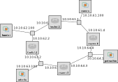

## Cloudlab-specific instructions: Reserve resources

For this experiment, we will use a topology with four routers in a ring, and a host connected to each LAN.

The topology for this experiment, with the IP address of each interface, is illustrated in the following diagram:



The topology has four LANs:

* 10.10.61.0/24 (LAN 61)
* 10.10.62.0/24 (LAN 62)
* 10.10.63.0/24 (LAN 63)
* 10.10.64.0/24 (LAN 64)

For convenience, the last octet of each IP address is the router index (for routers) or 100 (for workstations), so that it is easy to identify.

To reserve these resources on Cloudlab, open this profile page:

https://www.cloudlab.us/p/nyunetworks/education?refspec=refs/heads/dynamic_basic_22

Click "next", then select the Cloudlab project that you are part of and a Cloudlab cluster with available resources. (This experiment is compatible with any of the Cloudlab clusters.) Then click "next", and "finish".

Wait until all of the sources have turned green and have a small check mark in the top right corner of the "topology view" tab, indicating that they are fully configured and ready to log in. Then, click on "list view" to get SSH login details for the client, router, and server hosts, and SSH into each.

Before you start, use `ip addr` to capture the network interface configuration of each host and router in this topology. Save this for your reference.

On boot, each workstation and router will only have routing rules for subnets that it directly connects to (and for the control interface). It will not have routing rules for other subnets in the experiment topology. Confirm this with

```
ip route
```
