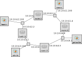

## Reserve resources for RIP experiment

For this experiment, we will use a topology with four routers in a ring, and a host connected to each LAN.

To set up this topology in the GENI Portal, create a slice, click on "Add Resources", and load the RSpec from the following URL: https://raw.githubusercontent.com/ffund/tcp-ip-essentials/gh-pages/rspecs/dynamic-routing.xml

The topology for this experiment, with the IP address of each interface, is illustrated in the following diagram:



The topology has four LANs:

* 10.10.61.0/24 (LAN 61)
* 10.10.62.0/24 (LAN 62)
* 10.10.63.0/24 (LAN 63)
* 10.10.64.0/24 (LAN 64)

For convenience, the last octet of each IP address is the router index (for routers) or 100 (for workstations), so that it is easy to identify

Once you have loaded the topology in the GENI Portal, bind to an InstaGENI site and reserve your resources. (You can refer to the [monitor website](https://fedmon.fed4fire.eu/overview/instageni) to identify an InstaGENI site that has many "free VMs" available.) Wait for your resources to become available for login ("turn green" on your canvas). 

This RSpec also defines a configuration script that runs when each host boots, so after the resources "turn green", wait a few more minutes beyond that for the configuration script to finish running. Then SSH into each, using the details given in the GENI Portal.

Before you start, use `ifconfig -a` to capture the network interface configuration of each host and router in this topology. Save this for your reference.

On boot, each workstation and router will only have routing rules for subnets that it directly connects to (and for the control interface). It will not have routing rules for other subnets in the experiment topology. Confirm this with

```
route -n
```
