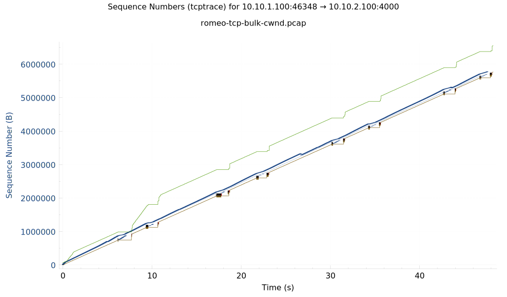

## TCP bulk file transfer

In a previous exercises about TCP sockets, we observed an *interactive* data transfer, where the data to send was generated by an interactive process. That connection was *application-limited* - the rate at which data is transferred across the connection is mainly limited by the rate at which the application produces data to send. With the interactive application, data was placed in the send buffer intermittently, at a low rate.

In contrast to the interactive application, in this exercise we will use a *bulk* data transfer, where we send a large volume of data across the network - for example, a large file. Under these circumstances, the application has a large volume of data to place in the send buffer, so the connection will not be application-limited. In that case, the rate at which data is transferred across the connection may be limited by either the congestion window (CWND) or the receive window (RWND):

* The connection will be CWND-limited if there are so many bytes "in flight" - sent but not yet acknowledged - that if we sent another segment, the number of bytes "in flight" would exceed the congestion window. The application may keep putting data into the socket send buffer as long as it has free space, but the operating system won't send it until some of the data "in flight" is acknowledged.
* The connection will be RWND-limited if the receiver does not have enough space in its receive buffer to accept new segments. The application at the sender side may keep putting data into the socket send buffer as long as it has free space, but the operating system won't send it until the advertised window size of the receiver indicates free space in the receive buffer.

In this exercise, we'll explore those circumstances further. 


### Setup

First, we need to get the bulk data to send. On romeo, run

```
wget -O file.txt http://www.gutenberg.org/files/100/100-0.txt
```

to retrieve a file from the Internet and save it as `file.txt`. 

Also download the Python scripts we'll use to transfer bulk data. These scripts use the same socket commands you're familiar with from the previous exercise.

On romeo, run

```
wget https://raw.githubusercontent.com/ffund/tcp-ip-essentials/gh-pages/lab-tcp/file-sender.py -O file-sender.py
```

On juliet, run

```
wget https://raw.githubusercontent.com/ffund/tcp-ip-essentials/gh-pages/lab-tcp/file-receiver.py -O file-receiver.py
wget https://raw.githubusercontent.com/ffund/tcp-ip-essentials/gh-pages/lab-tcp/file-receiver-slow.py -O file-receiver-slow.py
```

Next, configure the router as a 1 Mbps bottleneck, with a buffer size of 0.1 MB, in both directions. On the router, run

```
sudo tc qdisc del dev EXPIFACE1 root  
sudo tc qdisc add dev EXPIFACE1 root handle 1: htb default 3  
sudo tc class add dev EXPIFACE1 parent 1: classid 1:3 htb rate 1Mbit  
sudo tc qdisc add dev EXPIFACE1 parent 1:3 handle 3: bfifo limit 0.1MB

sudo tc qdisc del dev EXPIFACE2 root  
sudo tc qdisc add dev EXPIFACE2 root handle 1: htb default 3  
sudo tc class add dev EXPIFACE2 parent 1: classid 1:3 htb rate 1Mbit  
sudo tc qdisc add dev EXPIFACE2 parent 1:3 handle 3: bfifo limit 0.1MB  
```

Don't worry if you see a message in the output that says

```
Error: Cannot delete qdisc with handle of zero.
```

This is normal, and not a problem!


As bulk data traverses the network, it goes through multiple buffers (also called queues): the socket send buffer on the sender, the egress buffer on intermediate routers, and the socket receive buffer on the receiver. We'll monitor all of these buffers continuously throughout the experiment.

In a Linux terminal on both romeo and juliet, run

```
watch -n 0.1 ss -t -o state established -ni src 10.10.0.0/16
```

to monitor the send and receive queues in real time.

On the router, to monitor the egress queue that buffers traffic from romeo to juliet, identify the name of the interface that is connected to the same LAN as juliet. Then, run

```
watch -n 0.1 tc -s qdisc show dev IFACE
```

where in place of `IFACE`, substitute the name of that interface.

Leave these running throughout the experiments in this section

### Exercise: CWND-limited bulk file transfer

First, we'll see what happens when data is sent at a rate faster than the network can transfer it. 

On romeo, run

```
sudo tcpdump  -s 80 -i EXPIFACE1 -w $(hostname -s)-tcp-bulk-cwnd.pcap  
```

to save the packet headers to a file.


Now, we'll transfer the `file.txt` file from romeo to juliet.

On juliet, run

```
python3 file-receiver.py
```

Then, on romeo, run


```
python3 file-sender.py
```

Watch the queues as you transfer the file, and take a screenshot of the queue status while the file transfer is ongoing. Which queues appear to have data waiting in them? 

(If the file transfer happened too fast, you can try it again! Just stop the `tcpdump` and the Python processes with Ctrl+C, wait some time for the `TIME_WAIT` state to end, and repeat the steps above.)

Once the file transfer is complete, on juliet, run


```
cat file.txt
```

to verify the received file contents.

Use Ctrl+C to stop the `tcpdump`, and then transfer the packet capture file to your laptop using `scp`.

Open the packet capture with Wireshark, and use the `tcp` display filter to view only the TCP traffic. In the Wireshark menu, choose Statistics > TCP Stream Graphs > Time Sequence (tcptrace). This should open a figure similar to the following:



You can use your mouse to zoom in on different parts of the plot, and the "Reset" button to reset the zoom. Also, make sure that your plot shows the TCP stream in the direction of the data transfer; if it does not, use the "Switch Direction" button underneath the plot. 

In this image, TCP sequence numbers are plotted against time. 

* Each transmitted packet is shown as a vertical blue line, where the bottom of line is at the (relative) sequence number of that packet, and the height of the line is the TCP segment length of that packet. Since the sequence number is incremented by one for each byte sent, this vertical blue line shows the "range" of sequence numbers included in the packet. When you click on the center of one of the vertical blue lines, it will highlight that packet in the Wireshark packet list pane.
* The green line shows the "calculated" receive window size. This is the receive window size plus the last ACK number, i.e. what is the largest sequence number the sender can send without being RWND-limited? The difference between the green line and the blue transmitted packets shows us how much space the receiver has in its buffer.
* The brown line shows the ACK number. The difference between the brown line and the blue transmitted packets shows us the number of bytes "in flight". The sender is not allowed to have more bytes "in flight" than the CWND.
* SACKs are shown as red vertical lines. The bottom and top of the line shows the of sequence numbers acknowledged by the SACK.


**Lab report**: On the `tcptrace` plot (from Wireshark) for this bulk data transfer, zoom in on a 10-second interval in the middle of the file transfer. For some instance of time in this interval, annotate your image to indicate 1) the (approximate) sequence number of the current segment, 2) the (approximate) ACK nummber of the most recently received ACK, 3) the (approximate) number of bytes "in flight", 4) the (approximate) maximum segment number this host can send without exceeding the other host's advertised receive window size, and 5) the (approximate) free space in the other host's receive buffer, in bytes.


**Lab report**: Show a screenshot of the queue status on both hosts in middle of the bulk file transfer. Annotate the screenshot; circle the socket send buffer on the TCP sender and the receive queue on the TCP receiver. How can you tell that the connection is *not* application-limited? How can you tell that the connection is *not* RWND-limited?


### Exercise: RWND-limited bulk file transfer

Next, we'll see what happens when data is sent at a rate faster than the receiving application can process it. 

On romeo, run

```
sudo tcpdump  -s 80 -i EXPIFACE1 -w $(hostname -s)-tcp-bulk-rwnd.pcap  
```

to save the packet headers to a file.


Now, we'll transfer the `file.txt` file from romeo to juliet.

On juliet, run the application that removes data from the receive buffer very slowly - 

```
python3 file-receiver-slow.py
```

Then, on romeo, run


```
python3 file-sender.py
```

Watch the queues as you transfer the file, and take a screenshot of the queue status while the file transfer is ongoing. Which queues appear to have data waiting in them? 

(If the file transfer happened too fast, you can try it again! Just stop the `tcpdump` and the Python processes with Ctrl+C, wait some time for the `TIME_WAIT` state to end, and repeat the steps above.)

Once the file transfer is complete, on juliet, run


```
cat file.txt
```

to verify the received file contents.

Use Ctrl+C to stop the `tcpdump`, and then transfer the packet capture file to your laptop using `scp`. Use Wireshark to visualize the Time/Sequence tcptrace plot. Again, make sure that your plot shows the TCP stream in the direction of the data transfer; if it does not, use the "Switch Direction" button underneath the plot.


**Lab report**: On the `tcptrace` plot (from Wireshark) for this bulk data transfer, zoom in on a 5-second interval in the middle of the file transfer. Explain how this image shows that the connection is RWND-limited.

**Lab report**: Show a screenshot of the queue status on both hosts in middle of the bulk file transfer. Annotate the screenshot; circle the socket send buffer on the TCP sender and the receive queue on the TCP receiver. How can you tell that the connection is *not* application-limited? How can you tell that the connection is probably RWND-limited, not CWND-limited?

**Lab report**: When a connection is RWND-limited, the receiver may sometimes send an ACK indicating that the receive buffer has no space available (i.e. Zero Window). Find one of these in your packet capture. You are also likely to see some ACKs in your packet capture that are TCP Window Update ACKs. Find one of these in your packet capture, and also find the ACK that is sent by the receiver just *before* the TCP Window Update. Compare the ACK number and the advertised window size in these two ACKs - the TCP Window Update and the ACK immediately preceding it. What is the purpose of the TCP Window Update? Does it acknowledge previously unacknowledged segments?

