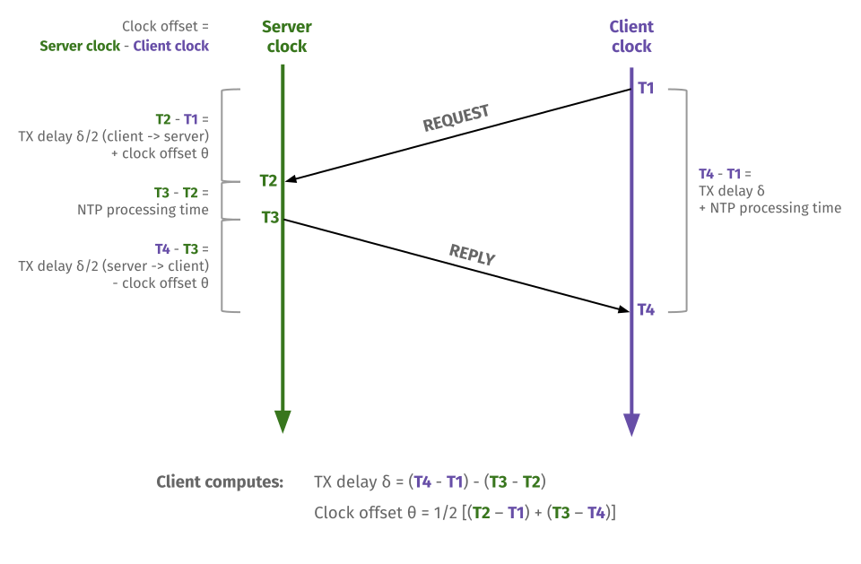

## NTP exercises

For this experiment, you will need two hosts on a LAN.

* If you still have access to resources from the "Basic home gateway services: DHCP, DNS, NAT" experiment, AND they are still configured as described there (including NAT), you can use the two client nodes from that topology.
* Alternatively, if you have lost access to those resources, reserve two nodes for this experiment using the following profile: [https://www.cloudlab.us/p/nyunetworks/education?refspec=refs/heads/one_seg_two_hosts](https://www.cloudlab.us/p/nyunetworks/education?refspec=refs/heads/one_seg_two_hosts)


### Exercise: date command

On Linux, the `date` command is used to display and change the system time of a host. Use

```
man date
```

to see the manual page for this utility, and study its options and usages.

Try the following `date` commands:

```
date
date --date='2 days ago'
date --date='3 months 2 days' 
sudo date --set='+1 seconds'
```

### Exercise: using NTP to find time offset

NTP can be used to determine the time offset between an NTP client and server as follows. First, the NTP client sends a packet containing its own timestamp to the server in the "Transmit Timestamp" field of an NTP packet. When the NTP server receives the packet, it responds with an NTP packet where the

* The "Origin Timestamp" or "Originator Timestamp" is the time (according to the _client's_ system clock) when the request departed the client en route to the server. The server finds this from the "Transmit Timestamp" in the client's NTP packet
* The "Receive Timestamp" is the time (according to the _server's_ system clock) when it received the client's NTP request
* The "Transmit Timestamp" is the time (according to the _server's_ system clock) when it sends its NTP reply
* The "Reference Timestamp" is the time that the NTP server's system time was last set or corrected

When the client receives the reply, it computes four time values:

* **T1**: the "Origin Timestamp" from the NTP reply
* **T2**: the "Receive Timestamp" from the NTP reply
* **T3**: the "Transmit Timestamp" from the NTP reply
* **T4**: the time (according to the _client's_ system clock) at which the NTP reply is received by the client.

Using these time fields, the client will compute the round-trip transmission delay between the NTP client and server, as

δ = (T4 – T1) – (T3 – T2)

and the offset of the client clock from the server clock as

θ = 1/2 [(T2 – T1) + (T3 – T4)]



On Linux, the `ntpdate` command can be used to query an NTP server and to set the system time using NTP. Use

```
man ntpdate
```

to see the manual page for this utility, and study its options and usages.

You are going to use `ntpdate` on one of your clients to query a pool of NTP servers on the Internet. First, use the `date` command to create an offset of a few seconds on the client. 

Then, start a `tcpdump`. The following `tcpdump` command uses command substitution to fill in the name of the network interface that is used to reach the Internet, and then use `tcpdump` to capture NTP traffic on that interface - 

```
sudo tcpdump -i $(ip route get 8.8.8.8 | grep -oP "(?<=dev )[^ ]+") 'udp port 123' -w ntp-$(hostname -s).pcap
```

to capture NTP traffic.

Then, while `tcpdump` is running, open another SSH session to the same client node, and run

```
ntpdate -p 1 -q pool.ntp.org
```

to query the NTP server pool at `pool.ntp.org` (over the public Internet), requesting one sample from each time server.

Save the response for your lab report.

**Note**: a response line with 

```
server X, stratum 0, offset 0.000000, delay 0.00000
```

in the `ntpdate` output indicates that there was no response from the server X. This line of output should not be used in any computations.

Stop the `tcpdump` and transfer the packet capture to your laptop with `scp`. You can also play back the packet capture with

```
tcpdump -tt -nv -r ntp-$(hostname -s).pcap
```

**Note**: the `-tt` argument to `tcpdump` asks `tcpdump` to show packet timestamps in [epoch timestamp format](https://en.wikipedia.org/wiki/Unix_time). To convert from epoch format to [NTP timestamp format](https://en.wikipedia.org/wiki/Network_Time_Protocol#Timestamps), add 2208988800 seconds.

**Lab report**: How many NTP servers did the client receive a response from? What stratum did each server belong to, and what was the estimated network delay to each server from the client? In the last line of the `ntpdate` output, it reports the result from the server it considers most reliable - can you explain (using stratum and delay values) why it selects the server it did in your example? 


**Lab report**: Select _one_ NTP request and its associated response from your packet capture. For that NTP transaction, show the NTP request and response, and answer the following questions:

* What is **T1**, **T2**, and **T3**? You can find these values in the NTP packet.
* **T4** is not included in the NTP packet. However, you can approximate **T4** using the timestamp of the NTP reply in `tcpdump` (don't forget to convert from epoch format to NTP format!) Then, use  **T1**, **T2**, **T3**, and **T4** to find the offset θ. Show your work! (Note: since your estimate of **T4** from the packet timestamp is not exactly the time at which the packet was passed to the NTP client *application*, you should not expect your estimated offset θ to match the `ntpdate` output output precisely. An "error" of 10ms or less is not a cause for concern.)

### Exercise: sync time with NTP

The Network Time Protocol daemon `ntpd` can be used to maintain system time in sync with NTP time servers. We will use it to synchronize the two client nodes using NTP.

First, open two terminal windows, one to each client, and place them side-by-side in your display. In each, run

```
watch -n 0.1 timedatectl
```

on each host to show the output of the `timedatectl` command every 0.1 seconds. 

On a second terminal in each host, run

```
sudo service ntp stop
```

to stop the `ntp` service, if it is running.

Find the time offset between the two hosts (from the output of the `timedatectl` command). If there is no time offset, use the `date` command (as in Exercise 6) to adjust the system time of one of the hosts by a few seconds, so that there is a small offset. For example, you can shift the clock on one client with:

```
sudo date --set='+3 seconds'
```


Take a screenshot showing both windows simulataneously with the `timedatectl`. Annotate the screenshot to show the time offset between the two hosts.

Then, while `timedatectl` is running, use the second terminal on each host to run

```
sudo ntpd -gq -d 1 0.us.pool.ntp.org 1.us.pool.ntp.org
sudo service ntp start
```

on both client nodes, to sync them with the same NTP time servers and set the time using NTP.

Now, check the `timedatectl` output again. Take a screenshot showing both windows simultaneously, and compare the date/time offset between the two hosts.


**Lab report**: Show a screenshot of your two hosts' time, side by side, 

* before synchronizing with NTP, when there is a time offset, and
* after synchronizing with NTP.


