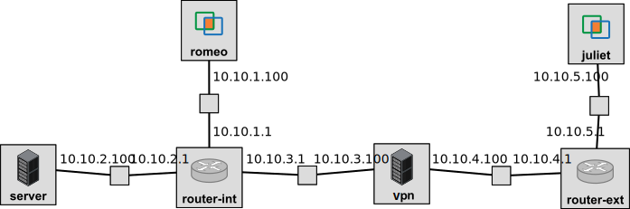

## FABRIC-specific instructions: Reserve resources

For this experiment, we will use the topology illustrated here, with IP addresses as noted on the diagram and a subnet mask of 255.255.255.0 on each interface:



To run this experiment on FABRIC, open the JupyterHub environment on FABRIC, open a shell, and run

```
git clone https://github.com/ffund/tcp-ip-essentials.git
git checkout wip
```

In the File Browser on the left, first go to the directory "tcp-ip-essentials", and then go to the directory "lab-snmp-security".

Then open the notebook titled "setup.ipynb".

Follow along inside the notebook to reserve resources and get the login details for each node in the experiment.