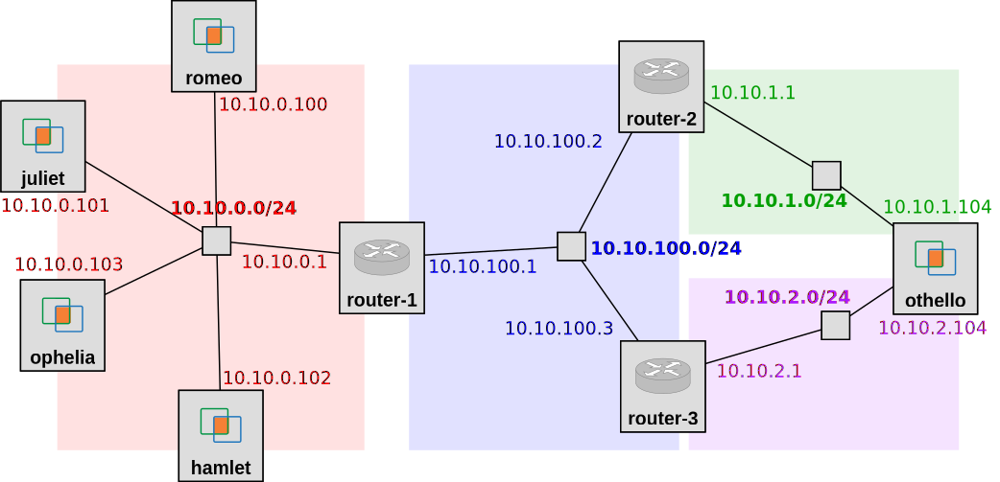

## FABRIC-specific instructions: Reserve resources

For this experiment, we will use a topology with five hosts, three routers, and four network segments, with addresses on each network interface configured as follows:



each with a netmask of 255.255.255.0.

To run this experiment on FABRIC, open the JupyterHub environment on FABRIC, open a shell, and run

```
git clone https://github.com/ffund/tcp-ip-essentials.git
git checkout wip
```

In the File Browser on the left, first go to the directory "tcp-ip-essentials", and then go to the directory "lab-static-basic".

Then open the notebook titled "setup.ipynb".

Follow along inside the notebook to reserve resources and get the login details for each node in the experiment.

Use `ip addr` to view the network interface configuration on each host, and save the output for your own reference.