## Exercises with IP address and subnet mask in a single segment network

You may have assumed that a routing table is only relevant when there are routers connecting multiple networks; but routing tables are also used at end hosts to determine how to send packets, even on a single segment! In this exercise, we'll explore this further.

In a previous experiment, we saw that when a host needs to send an IP packet, it uses ARP to resolve the destination IP address to a MAC address. We observed three possible outcomes of this process:

* a host already has the destination IP address in its ARP table. In this case, it will directly send the IP packet with the destination host's MAC address (from the ARP table) in the destination address field of the Layer 2 header.
* a host does _not_ already have the destination IP address in its ARP table, it sends an ARP request to resolve the address, and it receives an ARP reply. Then, it will send the IP packet with the destination host's MAC address (from the ARP reply) in the destination address field of the Layer 2 header.
* a host does _not_ already have the destination IP address in its ARP table, and it sends an ARP request to resolve the address, but does _not_ receive an ARP reply. Then, it will send itself an ICMP Destination Unreachable: Host Unreachable message, indicating that it cannot reach the destination IP address. The IP packet is not sent.

However, these three scenarios only occur if the host _first_ checks its routing table, and determines that the route that matches this destination address is a **directly connected** route.

A **directly connected** route is one where:

* the `G` flag is _not_ set
* there is no gateway specified

When a network interface on a device is configured with an IP address and subnet mask, a directly connected route is *automatically* added to the routing table on that device. This automatic rule applies to all destination addresses in the same subnet as the network interface.

If the destination address of an IP packet does not match a directly connected route, however, then the host won't try to resolve its IP address to a MAC address, since it will not send directly to the destination. It will either:

* return a "network unreachable" error if there is no routing table rule that applies to that destination address
* or, if the matching routing table rule is _not_ a direct route, but includes a gateway, it will try to resolve the _gateway_'s IP address, to use the gateway's MAC address in the destination address of the packet's Layer 2 header.

These scenarios are summarized in the following flow chart: 




In these exercises, we will configure IP addresses and subnet masks of the hosts on the single segment network in various ways, and observe the effect of each configuration as hosts try to reach one another over the network segment. Note that in these exercises, the packets will not be forwarded by a router - all of the hosts are physically connected to the same network segment, with no router separating them.


### Exercise - network unreachable

First, we will see what happens when we try to reach a host at an address for which we do not have a routing rule.


On "romeo", run

```
ip neigh dev EXPIFACE1
```

and 


```
ip route
```

to see the current ARP table and routing table. Save these for your lab report. Are there any entries in either table that apply to the address 10.10.10.100?

Then, run


```
sudo tcpdump -i EXPIFACE1 -w $(hostname -s)-net-unreachable.pcap
```

on "romeo". While `tcpdump` is running, open a second terminal to "romeo" and in that terminal, use `ping` to send an ICMP echo request to IP address 10.10.10.100:


```
ping -c 1 10.10.10.100
```

Save the `ping` output. Use Ctrl+C to stop the `tcpdump`, then use 

```
tcpdump -enX -r $(hostname -s)-net-unreachable.pcap
```

to play back the summary in the terminal.


Next, add a rule to the routing table on "romeo" that applies to 10.10.10.100:

```
sudo ip route add 10.10.10.100 dev EXPIFACE1
```

This rule says: "Send traffic for the host address 10.10.10.100 directly from the `EXPIFACE1` interface". ("Directly" means that the packet will not be forwarded by a router. Since we did not specify the address of a "gateway" router, this route is a "direct" route.)

Then use 

```
ip route
```

to see the new routing table. Save this for your lab report. 

Now, run


```
sudo tcpdump -i EXPIFACE1 -w $(hostname -s)-host-unreachable.pcap
```

on "romeo". While `tcpdump` is running, open a second terminal to "romeo" and in that terminal, use `ping` to send an ICMP echo request to IP address 10.10.10.100:


```
ping -c 1 10.10.10.100
```

Save the `ping` output. Use Ctrl+C to stop the `tcpdump`, then use 

```
tcpdump -enX -r $(hostname -s)-host-unreachable.pcap
```

to play back the summary in the terminal.

Use `scp` to transfer both packet captures to your laptop for further analysis using Wireshark.

Also delete the routing table rule you added earlier, with

```
sudo ip route del 10.10.10.100 dev EXPIFACE1
```

**Lab report**: Can you see any ICMP echo request sent on the network? Why? Explain what happened using the `ip route` output, the `ping` output, and the `tcpdump` output in each case.


**Lab report**: Why does "romeo" not send any ARP request in the first part of this exercise, but does send ARP requests in the second part?


### Exercise - experiments with subnet masks

In the previous exercise, we saw that if there is no rule in a routing table that applies to a packet's destination address, the packet will not be sent and a "Network unreachable" error is raised.

However, you may recall that in previous experiments, we exchanged packets between hosts without adding any rules to their routing tables! This is because when a network interface is configured with an IP address and subnet mask, a "directly connected network" rule is *automatically* added to the routing table. This rule applies to all destination addresses in the same subnet as the network interface, and says to send all traffic directly (without an "next hop" router) from that interface. 

Because of the automatically added rule, a Host A can send to Host B if Host B's IP address is within the range of addresses in Host A's subnet. If Host B's IP address is not within the range of addresses in Host A's subnet, then there will be no automatically added rule that applies to messages to Host B. Under these circumstances, either (1) a rule must be added, or (2) the packet will not be sent, and a "Network unreachable" error is returned.

For this experiment, you will need *two* terminals on *each* host in your topology. Set up your terminal application accordingly.

Configure the (experiment) interface on each host, according to the following table:


| Host          | IP address    | Subnet mask     |
| ------------- | ------------- |-----------------|
| romeo         | 10.10.0.100   | 255.255.255.240 |
| juliet        | 10.10.0.101   | 255.255.255.0   |
| hamlet        | 10.10.0.102   | 255.255.255.0   |
| ophelia       | 10.10.0.120   | 255.255.255.240 |


To change the IP address and/or netmask of a given interface on our hosts, use the syntax

```
sudo ip addr add NEW-IP-ADDRESS/NEW-PREFIX dev INTERFACE
sudo ip addr del OLD-IP-ADDRESS/OLD-PREFIX dev INTERFACE
```

substituting appropriate values for `NEW-IP-ADDRESS`, `NEW-PREFIX`, `OLD-IP-ADDRESS`, `OLD-PREFIX`, and `INTERFACE` name.


Run 


```
ip route
```

on each host, and save the routing tables. 


We will run this exercise in four parts:


#### Part 1

On each host, run

```
sudo tcpdump -en -i EXPIFACE1
```

From "romeo", ping "hamlet" (10.10.0.102) or "juliet" (10.10.0.101):


Observe what happens. Stop your `tcpdump`, and save the `tcpdump` output for all the hosts.

#### Part 2

On each host, run

```
sudo tcpdump -en -i EXPIFACE1
```

From "ophelia", ping "hamlet" (10.10.0.102) or "juliet" (10.10.0.101). Note the output in the `ping` window.

Observe what happens. Stop your `tcpdump`, and save the `tcpdump` output for all the hosts.

#### Part 3

On each host, run

```
sudo tcpdump -en -i EXPIFACE1
```

From "hamlet" or "juliet", ping "romeo" (10.10.0.100)

Observe what happens. Stop your `tcpdump`, and save the `tcpdump` output for all the hosts.

#### Part 4

On each host, run

```
sudo tcpdump -en -i EXPIFACE1
```

From "hamlet" or "juliet", ping "ophelia" (10.10.0.120).

Observe what happens. Stop your `tcpdump`, and save the `tcpdump` output for all the hosts.


### Restore the original configuration

Once you have finished these steps, restore the original network interface configuration on romeo, juliet, hamlet, and ophelia. 
Refer to the network diagram from the resource reservation step, and use the syntax


```
sudo ip addr add NEW-IP-ADDRESS/NEW-PREFIX dev INTERFACE
sudo ip addr del OLD-IP-ADDRESS/OLD-PREFIX dev INTERFACE
```

substituting appropriate values for `NEW-IP-ADDRESS`, `NEW-PREFIX`, `OLD-IP-ADDRESS`, `OLD-PREFIX`, and `INTERFACE` name.


---


**Lab report**: In the routing table for each host, show the rule that applies to traffic that is sent within the same subnet. (This rule is added to the routing table automatically when you configure the IP address and netmask on the network interface.) 


**Lab report**: Use bitwise analysis to answer the following questions. Show how the netmask was applied in each case.

* What is the range of usable IP addresses (i.e. smallest IP address and largest IP address) that is in the same subnet as "romeo"?
* What is the range of usable IP addresses (i.e. smallest IP address and largest IP address) that is in the same subnet as "juliet"?
* What is the range of usable IP addresses (i.e. smallest IP address and largest IP address) that is in the same subnet as "hamlet"?
* What is the range of usable IP addresses (i.e. smallest IP address and largest IP address) that is in the same subnet as "ophelia"?

**Lab report**: For each of the four parts of this experiment, show the `tcpdump` output for both endpoints - the host you ping *from* and the host you send the ping *to*. Then, explain why the other hosts cannot exchange ICMP echo messages with "ophelia", while they can with "romeo", which has the same subnet mask as "ophelia". Use your answer to the previous question to support this explanation.

