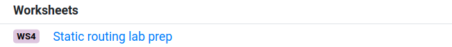
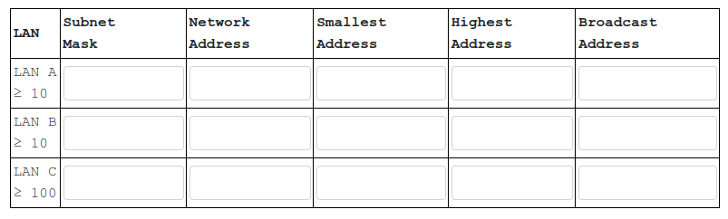
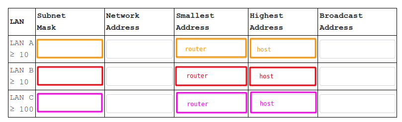

## Subnet design

In this experiment, we'll practice setting up a complete IP network, including:

* allocating addresses from a larger address block to specific LANs
* assigning an address and subnet mask to each interface in each LAN
* setting up static routing rules so that hosts can reach one another across different LANs


### Find your design assignment in PrairieLearn

Your challenge is to design subnets for the three LANs, with the following design constraints:

* You may only use IP addresses in the available address space.
* You must assign a large enough space to each LAN to support the expected number of hosts.

Every student in the class will solve a slightly different version of this problem (different address space, and different number of hosts in each LAN). To get *your* specific instance of this problem, open the PrairieLearn site for your lab section and find the "Static routing lab prep" worksheet. *Your* design assignment is described at the top of the page.




In the rest of these instructions, I'll show how to solve *a* design assignment - but your assignment will be different! Once you understand how to solve this *type* of assignment (by following my example), you should be able to solve your own. 

You can test your solution _before_ you run any commands on your network by submitting your answers in the worksheet on PrairieLearn - it will tell you whether your work is correct. (You can submit partial answers to get partial feedback, too - you don't have to wait until you are finished with the entire worksheet to get feedback on your work in progress.)


### Allocate addresses to specific LANs

In the first part of this exercise, you will need to decide how to allocate the address space to specific LANs. There is more than one correct solution to this step! Any correct solution should be accepted.

Here is the process we will follow to allocate addresses to LANs:

1. Identify the smallest subnet mask (largest prefix length) that can support the number of hosts required on each LAN.
2. Allocate addresses to subnets, starting from the biggest subnet (most hosts) and continuing to the smallest (fewest hosts). For each subnet, identify the network address and the broadcast address. Then, identify the range of usable addresses in the subnet.

We'll go through an example. Suppose my assignment is to use the address range 10.1.24.0-10.1.24.255, and allocate addresses to three LANs as follows:

* LAN A must be able to support at least 10 hosts.
* LAN B must be able to support at least 10 hosts.
* LAN C must be able to support at least 100 hosts.

Recall that in a subnet, any bit that is set to 1 in the subnet mask is fixed for all addresses in the subnet, but any bit that is 0 in the subnet mask is "free". Therefore, given a subnet mask with _N_ bits set to 0, we can make 2<sup>N</sup> addresses, since each 0 bit in the subnet mask can become either a 0 or 1 bit in an address on that subnet. However, since each subnet needs a network address and a broadcast address (and these addresses are _reserved_ - they cannot be assigned to any network interface on the subnet), the number of interfaces we can address is 2<sup>N</sup>-2.

In our example, to be able to address 100 hosts on LAN C, we need 7 bits to be used for the host part of the address (2<sup>7</sup> - 2 = 126, which satisfies the requirement of 100 usable addresses.) Thus, LAN C should have a subnet mask of 255.255.255.128, which leaves the 7 rightmost bits free for the host address:

```
11111111.11111111.11111111.10000000
```

To be able to address 10 hosts each on LAN A and LAN B, we need 4 bits to be used for the host part of the address (2<sup>4</sup> - 2 = 14, which satisfies the requirement of 10 usable addresses.) Thus, LAN A and LAN B should have a subnet mask of 255.255.255.240, which leaves the 4 rightmost bits free for the host address:

```
11111111.11111111.11111111.11110000  
```

Now we are ready to begin allocating addresses to subnets. First, we'll convert the assigned 10.1.24.0/24 address range from dotted decimal notation to binary:

```
00001010.00000001.00011000.00000000  
```

It's usually easier to begin by allocating the largest subnet first, so we will start with LAN C.
We've already determined the subnet mask (255.255.255.128) for LAN C. Now, we check if the network address for the beginning of the range (10.1.24.0) is a valid address for this subnet: compute the network address AND the subnet mask, and make sure we get the network address as the result. 

```
00001010.00000001.00011000.00000000  
11111111.11111111.11111111.10000000  
-----------------------------------
00001010.00000001.00011000.00000000  
```

Since it is a valid network address for the subnet, we can assign 10.1.24.0 as the network address for LAN C. 

Next, we'll compute the broadcast address for the subnet. This is the bitwise OR of the network address and the inverse of the subnet mask:

```
00001010.00000001.00011000.00000000  
00000000.00000000.00000000.01111111  
-----------------------------------
00001010.00000001.00011000.01111111  
```

which is 10.1.24.127 in dotted decimal notation. 

The highest IP address that can be assigned to a host in the network is 10.1.24.126 (1 less than the broadcast address). The smallest IP address that can be assigned to a host in the network is 10.1.24.1 (1 more than the network address). The range of usable addresses in this subnet is therefore 10.1.24.1-10.189.24.126.


Next, we'll turn our attention to the second-largest LAN. In this case, LAN A and LAN B are the same size (both use the same subnet mask, 255.255.255.240), so we can assign either one next. I'll go with LAN B next. 

We've already determined that the subnet mask for LAN B should be 255.255.255.240.

We've already used up some of our IP address space on LAN C: 10.1.24.0-10.1.24.127 is going to be reserved for LAN C. So we are now left with the range 10.1.24.128-10.1.24.255 to work with. The address at the lower end of this range, 10.1.24.128, could be the network address for the next subnet, LAN B. In binary, this is:

```
00001010.00000001.00011000.10000000  
```

As before, we will compute the network address AND the broadcast mask, and make sure we get the network address as a result - if we do, then it is a valid network address for this subnet mask.

```
00001010.00000001.00011000.10000000  
11111111.11111111.11111111.11110000
-----------------------------------
00001010.00000001.00011000.10000000  
```

Next, we'll compute the broadcast address for the subnet. This is the bitwise OR of the network address and the inverse of the subnet mask:

```
00001010.00000001.00011000.10000000  
00000000.00000000.00000000.00001111  
-----------------------------------
00001010.00000001.00011000.10001111  
```

or 10.1.24.143 in dotted decimal notation. The highest IP address that can be assigned to a host in the network is 10.1.24.142 (1 less than the broadcast address). The smallest IP address that can be assigned to a host in the network is 10.1.24.129 (1 more than the network address). The range of usable addresses in this subnet is therefore 10.1.24.129-10.1.24.142.

Last, we will allocate addresses for LAN A. We've used up the lower part of our allocated address space, through 10.1.24.143, on LAN C and LAN B. so we are now left with the range 10.1.24.144-10.1.24.255 to work with. The address at the lower end of this range 10.1.24.144, could be the network address for the next subnet, LAN A. In binary, this is:


```
00001010.00000001.00011000.10010000  
```

We've already determined that the subnet mask for LAN A should be 255.255.255.240. We compute the network address AND the broadcast mask, and make sure we get the network address as a result - if we do, then it is a valid network address for this subnet mask.

```
00001010.00000001.00011000.10010000  
11111111.11111111.11111111.11110000
-----------------------------------
00001010.00000001.00011000.10010000  
```

Next, we'll compute the broadcast address for the subnet. This is the bitwise OR of the network address and the inverse of the subnet mask:


```
00001010.00000001.00011000.10010000  
00000000.00000000.00000000.00001111  
-----------------------------------
00001010.00000001.00011000.10011111  
```

or 10.1.24.159 in dotted decimal notation. The highest IP address that can be assigned to a host in the network is 10.1.24.158 (1 less than the broadcast address). The smallest IP address that can be assigned to a host in the network is 10.1.24.145 (1 more than the network address). The range of usable addresses in this subnet is therefore 10.1.24.145-10.1.24.158.

Once you have identified the subnet mask, network address, smallest usable address, highest usable address, and broadcast address for all three subnets, fill in the table in the PrairieLearn worksheet:




Verify that your solutions are correct for *your* individual assignment before you continue to the next step.

**Lab report**: In PrairieLearn, find the "Static routing lab prep" assignment in the "Worksheets" area. Open it to see your subnet design assignment, which is unique to you. When you have solved the subnet design problem, fill in the table in PrairieLearn; then scroll to the bottom and choose "Save and Grade". (You don't have to fill in the rest of the items in the configuration sections yet!)

Scroll down to the "submitted answer" panel, and find the graded version of your submitted solution. It should look similar to [this](https://raw.githubusercontent.com/ffund/tcp-ip-essentials/gh-pages/lab3/subnet-table-submitted.png), but with different values! Take a screenshot, and submit that screenshot.


### Configure network interfaces

The next step will be to assign an address to every LAN interface, in all three LANs. We will assign addresses to three interfaces (router, first host, second host) in each LAN, using the values in the table




where: 

* all three interfaces in a LAN will use the same subnet mask
* the router's LAN-facing interface will be assigned the smallest IP address in the subnet (this is a common convention, and we will follow this convention)
* one host will get the highest IP address in the subnet
* the second host can get any unused IP address that is within the address range for this subnet

We will use `ip addr` to assign an IP address and subnet mask to each interface.

Let's go back to my example, and follow along as we configure each network interface. Of course, the specific addresses and subnet masks in _your_ network will be different from mine! 

#### LAN A

First, we will identify the LAN-facing interface of router-a from the output of `ip addr`. The LAN-facing interface is the one that does *not* have any address assigned. 

In LAN A, the subnet mask was 255.255.255.240 and the smallest usable address was 10.1.24.145. So on router-a, I will run


```
sudo ip addr add 10.1.24.145/28 dev EXPIFACEX
```

where `EXPIFACEX` is the name of the LAN-facing interface on router-a.

On one host - say, romeo - we'll assign the highest usable address, which was 10.1.24.158:

```
sudo ip addr add 10.1.24.158/28 dev eth1
```

On another host - juliet - we'll assign any other unused address in this subnet. For example:

```
sudo ip addr add 10.1.24.150/28 dev eth1
```

When we configure a network interface, a routing table rule is automatically added for the directly connected subnet. We can see this by running


```
ip route show dev eth1
```

on each of the hosts, and 

```
ip route show dev eth1
ip route show dev eth2
```

on the router. The directly connected route should show the *network address* for LAN A at the front, the *prefix length* for LAN A as the prefix length after the network address, and `scope link` to indicate that this is a direct route with no gateway.

Since each interface in this subnet has an address and a route for the directly connected subnet, you should be able to `ping` any of the addresses assigned in LAN A, from any of the three devices in LAN A. Try this now, and verify that you have Layer 3 connectivity within LAN A.

#### LAN B


Next, we'll go to LAN B. Identify the LAN-facing interface of router-b from the output of `ip addr`. The LAN-facing interface is the one that does *not* have any address assigned. 


In LAN B, the subnet mask was 255.255.255.240 and the smallest usable address was 10.1.24.129. So on router-b, I will run


```
sudo ip addr add 10.1.24.129/28 dev EXPIFACEX
```

where `EXPIFACEX` is the name of the LAN-facing interface on router-b.

On one host - say, hamlet - we'll assign the highest usable address, which was 10.1.24.142:

```
sudo ip addr add 10.1.24.142/28 dev eth1
```

On another host - ophelia - we'll assign any other unused address in this subnet. For example:

```
sudo ip addr add 10.1.24.135/28 dev eth1
```

When we configure a network interface, a routing table rule is automatically added for the directly connected subnet. We can see this by running


```
ip route show dev eth1
```

on each of the hosts, and 

```
ip route show dev eth1
ip route show dev eth2
```

on the router. The directly connected route should show the *network address* for LAN B at the front, the *prefix length* for LAN B as the prefix length after the network address, and `scope link` to indicate that this is a direct route with no gateway.

Since each interface in this subnet has an address and a route for the directly connected subnet, you should be able to `ping` any of the addresses assigned in LAN B, from any of the three devices in LAN B. Try this now, and verify that you have Layer 3 connectivity within LAN B.


#### LAN C

Finally, we'll go to LAN C. Identify the LAN-facing interface of router-c from the output of `ip addr`. The LAN-facing interface is the one that does *not* have any address assigned. 

In LAN C, the subnet mask was 255.255.255.128 and the smallest usable address was 10.1.24.1. So on router-c, I will run


```
sudo ip addr add 10.1.24.1/25 dev EXPIFACEX
```

where `EXPIFACEX` is the name of the LAN-facing interface on router-c.


On one host - say, othello - we'll assign the highest usable address, which was 10.1.24.126:

```
sudo ip addr add 10.1.24.126/25 dev eth1
```

On another host - desdemona - we'll assign any other unused address in this subnet. For example:

```
sudo ip addr add 10.1.24.70/25 dev eth1
```

When we configure a network interface, a routing table rule is automatically added for the directly connected subnet. We can see this by running


```
ip route show dev eth1
```

on each of the hosts, and 

```
ip route show dev eth1
ip route show dev eth2
```

on the router. The directly connected route should show the *network address* for LAN C at the front, the *prefix length* for LAN C as the prefix length after the network address, and `scope link` to indicate that this is a direct route with no gateway.

Since each interface in this subnet has an address and a route for the directly connected subnet, you should be able to `ping` any of the addresses assigned in LAN C, from any of the three devices in LAN C. Try this now, and verify that you have Layer 3 connectivity within LAN C.

**Lab report**: After you have configured the network interfaces and routes according to your subnet design, show the network interface configuration as follows. On each of the six hosts - romeo, juliet, hamlet, ophelia, othello, desdemona - show the output of `ip addr show dev eth1`. On each of the routers, show the output of `ip addr show dev EXPIFACEX` where `EXPIFACEX` is the interface of the router on the LAN that has hosts.


### Configure static routes

At this point, each host in a LAN should be able to reach every other host in the same LAN. However, you will not be able to send and receive traffic between different LANs - for this, you'll need to add routing rules.


#### On the routers

We will start with the three routers. On each router, you will need to add a route to the two LANs it is _not_ directly connected to, following this format:

* **Destination address**: the network address of the LAN you want to reach
* **Prefix length**: the number of 1s in the subnet mask of the LAN you want to reach
* **Gateway**: the _Routing LAN-facing_ address of the router that is directly connected to the LAN you want to reach

Let's go back to my example. 

We will need to add a route to LAN A on two routers: router-b and router-c. The command will include the network address for LAN A (from our table), the prefix length for LAN A, and the Routing LAN-facing address of router-a (10.1.10.1). In my example, the command to add this route would be:

```
sudo ip route add 10.1.24.144/28 via 10.1.10.1
```

and I would run that on router-b and router-c.

Similarly, we need to add a route to LAN B on two routers: router-a and router-c. In my example, the command would be

```
sudo ip route add 10.1.24.128/28 via 10.1.10.2
```

and I would run that on router-a and router-c.

Finally, we need to add a route to LAN C on two routers: router-a and router-b. In my example, the command would be


```
sudo ip route add 10.1.24.0/25 via 10.1.10.3
```

and I would run that on router-a and router-b.


#### On the hosts

On the hosts, instead of adding a route for each specific destination LAN, we can add a route that matches destinations on all three LANs, and uses the LAN-facing interface of the router on the same LAN as the next hop. 

This rule will also match the local LAN, but because of longest prefix matching, the "directly connected" route will be applied to packets whose destination address is in the same LAN.

In my example, the address range I need to match is 10.1.24.0-10.1.24.255, so I should add a route for the destination address 10.1.24.0 and prefix length 24.

On romeo and juliet, which are in LAN A, the next hop address should be 10.1.24.145, which is the address I assigned to router-a's interface in LAN A:

```
sudo ip route add 10.1.24.0/24 via 10.1.24.145
```

On hamlet and ophelia, which are in LAN B, the next hop address should be 10.1.24.145, which is the address I assigned to router-b's interface in LAN B:

```
sudo ip route add 10.1.24.0/24 via 10.1.24.129
```

On othello and desdemona, which are in LAN C, the next hop address should be 10.1.24.1, which is the address I assigned to router-c's interface in LAN C:

```
sudo ip route add 10.1.24.0/24 via 10.1.24.1
```

At this point, every host in the network should be able to reach every other host (by IP address)! Use `ping` to verify this.

On romeo, `ping` every other host by address - juliet, hamlet, ophelia, othello, and desdemona. Save the output for your lab report.


**Lab report**: After you have configured the network interfaces and routes according to your subnet design, show the output of `ping` *from* "romeo" to *each* of the five other hosts - juliet, hamlet, ophelia, othello, and desdemona. (Five total `ping` commands with output.)

#### Save the routing table on each host and router

On each host, run

```
ip addr
```

and 

```
ip route show dev eth1
```

and on each router, run

```
ip addr
```

and 

```
ip route show dev eth1
ip route show dev eth2
```

and save this final output for your lab report.

**Lab report**: After you have configured the network interfaces and routes according to your subnet design, show the output of `ip route show dev eth1` on the "romeo" host. Annotate the output to indicate:

1. which rule will apply to traffic from romeo to juliet
2. which rule will apply to traffic from romeo to hamlet
3. which rule will apply to traffic from romeo to ophelia
4. which rule will apply to traffic from romeo to othello
5. which rule will apply to traffic from romeo to desdemona

If there are multiple matching rules, indicate the *one* that applies in each case according to the longest prefix matching rule.

Also show the output of `ip route show dev eth1` and `ip route show dev eth2` on "router-a". Annotate the output to indicate:

1. which rule will apply to traffic from hamlet to romeo
2. which rule will apply to traffic from romeo to hamlet
3. which rule will apply to traffic from romeo to othello

