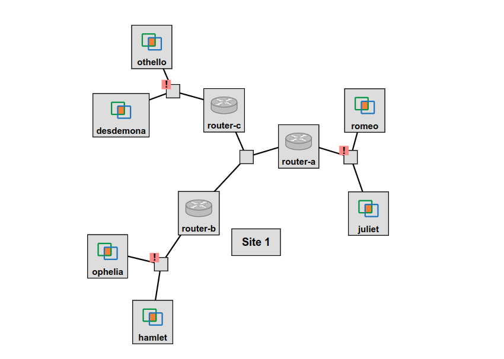

## FABRIC-specific instructions: Reserve resources

For this experiment, you will reserve a topology that includes three routers (router-a, router-b, and router-c) and two hosts connected to each router. The routers will already be configured with IP addresses (in the 10.1.10.0/24 subnet) on the link that connects the routers to one another. However, it will be up to you to design subnets for the small LAN connected to each router.

The topology will look like the following:



To run this experiment on FABRIC, open the JupyterHub environment on FABRIC, open a shell, and run

```
git clone https://github.com/ffund/tcp-ip-essentials.git
git checkout wip
```

In the File Browser on the left, first go to the directory "tcp-ip-essentials", and then go to the directory "lab-static-design".

Then open the notebook titled "setup.ipynb".

Follow along inside the notebook to reserve resources and get the login details for each node in the experiment.

Use `ip addr` to view the network interface configuration on each host, and save the output for your own reference. 

In particular, make sure to note **the name of the interface on each router that is on the 10.1.10.0/24 subnet** (Routing LAN), and the name of the interface that has no assigned address yet (LAN).