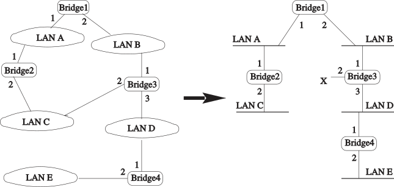

In this experiment, we will see how broadcast storms can occur in a network with bridge loops (multiple Layer 2 paths between endpoints). Then, we will see how the spanning tree protocol creates a loop-free logical topology in a network with physical loops, so that a broadcast storm cannot occur. We will also see how the spanning tree protocol reacts when the topology changes.

## Background

An Ethernet switch or bridge relays Ethernet frames between devices connected to different ports. It thereby links multiple hosts (or smaller network segments each with multiple hosts) into a single connected network.

When a frame arrives at a switch or a bridge, the forwarding table is used to determine whether to forward, filter, or flood the frame, depending on its destination address:

* When the switch receives a frame that is destined for an address that is not in the table, the switch will flood the frame out of all ports except for the port on which it arrived.
* If the destination address is in the table, and is known to be reachable on the same port that the frame was received on, the switch will filter (drop) the frame.
* Otherwise, the switch will forward the frame out of the port associated with its destination address in the forwarding table.

While this usually works well, problems arise in the event of a bridging loop. For various reasons (e.g. redundancy in case of a link failure), a network may have multiple Layer 2 paths between two endpoints - a bridging loop. This can lead to a _broadcast storm_:

* When a broadcast packet arrives at a switch, copies will be flooded out all ports other than the one it arrives on.
* Other switches in the network will also flood copies of the packet out all ports other than the one it arrives on. 
* Eventually, it will re-appear at the switch that first flooded the packet - but on a different port than the one it originally arrived on. Copies will be flooded out all other ports, including the port that the packet was first seen on.
* As more and more copies are created, the large volume of copies can saturate the network, preventing other traffic from getting through.
* Because Ethernet frames do not have a time-to-live (TTL) field, like IP packets, they will not be discarded - copies of the frame can keep circulating in the network forever.

The spanning tree protocol addresses this issue in a network with physical loops by setting some redundant paths to a blocked state and leaving others in a forwarding state. This creates a loop-free logical topology, so that a broadcast storm cannot occur. However, the network still benefits from the added reliability of redundant paths: if a link that is in a forwarding state becomes unavailable, then the protocol will reconfigure the tree and re-activate blocked paths as necessary, to restore connectivity.

_<small>Example of a bridged network with a loop, and the minimum spanning tree with the loop removed. (From "TCP/IP Essentials: A Lab-Based Approach", Figure 3.3.)</small>_

To create a loop-free tree, each bridge in the network assigns itself a unique bridge ID, formed from a priority concatenated with the MAC address of the first bridge port. Then, they execute the spanning tree protocol as follows:

1. **Elect a root switch or bridge**. The bridge or switch with the lowest bridge ID is elected as the root bridge.
2. **Elect a root port on each non-root bridge**.  Each bridge (except the root bridge) computes the _root path cost_, i.e. cost of the path to the root bridge, through each port. Then, the _root port_ is elected - the one with the lowest root path cost.
3. **Select a designated bridge and port on each network segment**.  The bridge and port on each network segment with the lowest root path cost will be selected as the designated bridge and port.
4. **Set bridge ports' states**. Only root ports or designated ports can receive or forward user frames on a network segment. Other bridge ports are set to the "blocked" state. (A "blocked" port may still receive spanning tree BPDUs, but not user frames!)

To execute this protocol in a distributed fashion, bridges exchange BPDUs with their neighbors describing their current spanning tree configuration, and then they update their configuration based on the received BPDUs. Eventually, the network will converge to a common spanning tree. 

In this experiment, we will create a topology with a loop, then watch as the spanning tree algorithm creates a logical loop-free topology.
