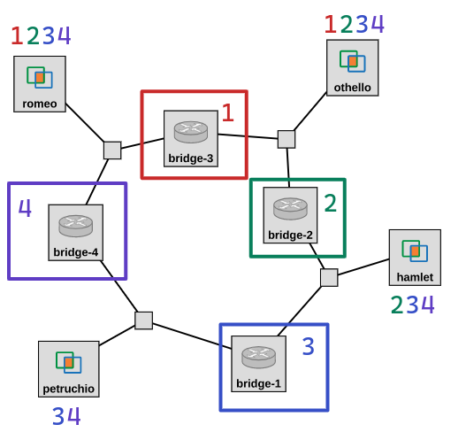

## Observe the spanning tree protocol

Now that we have seen what can happen _without_ the spanning tree protocol, we will set up the bridges to form a logical loop-free topology using the STP. 

We'll bring up one bridge at a time, in a very specific order so that we can focus on different details of the protocol each time. For your reference, this figure shows the order in which we will bring up the bridges, and the hosts at which we will capture BPDUs each time.




At each stage, we will:

1. use `tcpdump` on the four hosts to capture BPDUs exchanged on every network segment,
2. bring up one bridge,
3. use `brctl showstp br0` to wait until the STP converges (until all of the bridge ports throughout the network are either in "forwarding" or "blocked" state), then
4. look at the BPDUs we captured.

For this section, you will need an SSH session on each bridge, and an SSH session on each of the other hosts.


### Network of one bridge 

In this step, we'll see what happens when a bridge is brought up, before it has received BPDUs from any other bridge.

On the four hosts, start a `tcpdump` to capture STP traffic on each network segment. Run

```
sudo tcpdump -i eth1 stp -w stp-$(hostname -s)-1.pcap
```

and leave these running.

We will start with a bridge that is *not* the final root bridge. First, we will bring up a bridge is located one step away from the final root bridge: **bridge-3**. 

On "bridge-3", run

```
sudo ip link set br0 up
```

Then, run

```
brctl showstp br0
```

on this bridge. Initially, the state of the bridge ports may appear as "learning". Repeat this until the state of each port is either "forwarding" or "blocked", and the "flags" section of the output is blank. Save the final output.


Then, stop the `tcpdump` processes running on the four hosts. You can play these back with

```
tcpdump -nv -r stp-$(hostname -s)-1.pcap
```

or use `scp` to transfer them to your laptop and open them in Wireshark.

In this experiment, "bridge-3" will have sent BPDUs on each of the network segments it is on, so you should find BPDUs in the packet capture on "romeo" and the packet capture on "othello". (The other two packet captures will not have BPDUs, since those network segments do not yet have any active bridge.)

**Lab report**: Show the BPDU sent by the bridge in the network segment that "romeo" is on, and identify the key values in the BPDU. Then, show the BPDU sent by the bridge on the network segment that "othello" is on, and identify the key values in the BPDU.


### Network of two bridges 

Next, we'll bring up a second bridge: **bridge-2** (which has the _smallest_ bridge ID of all the bridges in the network). We'll use this as an opportunity to understand how the root bridge is elected, when there is more than one bridge in the network.


On the four hosts, start a `tcpdump` to capture STP traffic on each network segment. Run

```
sudo tcpdump -i eth1 stp -w stp-$(hostname -s)-2.pcap
```

and leave these running.

Then, on "bridge-2", run

```
sudo ip link set br0 up
```

Wait until the output of

```
brctl showstp br0
```

on both of the "active" bridges ("bridge-3" and "bridge-2") shows that all ports are either "forwarding" or "blocked", and the "flags" section of the output is blank. Save the final output on each bridge.


Then, stop the `tcpdump` processes running on the four hosts. You can play these back with

```
tcpdump -nv -r stp-$(hostname -s)-2.pcap
```

or use `scp` to transfer them to your laptop and open them in Wireshark.


**Lab report**: Show the BPDU that "bridge-2" receives when it is brought up (from the BPDUs captured by "othello"), and the BPDU that "bridge-2" eventually sends on the same network segment. Also show the final `brctl showstp br0` output from "bridge-2" and "bridge-3" at this part of the experiment. 

**Lab report**: Explain how the root bridge is elected:

* Before it receives any BPDUs, "bridge-2" considers itself the root bridge (initial configuration). What is its bridge ID?
* Then, "bridge-2" receives a BPDU (with a different configuration). What is the root bridge ID in this BPDU?
* Will "bridge-2" consider itself the root bridge, or will it adopt the root bridge configuration from the BPDU it receives from "bridge-3"? Explain.
* What tiebreaker criteria is used to decide which configuration to adopt in this instance?


**Lab report**: After "bridge-2" is brought up, "bridge-3" changes its own network configuration. Show the BPDU that "bridge-3" initially sends on the network segment between itself and "bridge-4", and the BPDU it sends on this network segment at the end of this part of the experiment. List all the changes between the initial BPDU and the final BPDU. What is the reason for each change? Explain. When "bridge-3" receives a BPDU from "bridge-2" with a different configuration than the one in its initial BPDU, what tiebreaker criteria does it use to decide which configuration to adopt in this instance?


**Lab report**: At the end of this part of the experiment, which bridge sends BPDUs on the link between "bridge-2" and "bridge-1" (as captured on "hamlet")? Which bridge sends BPDUs on the link between "bridge-3" and "bridge-4" (as captured on "romeo")? Which bridge sends BPDUs on the link between "bridge-2" and "bridge-3" (as captured on "othello")? 


### Network of three bridges 

In this section, we'll bring up a third bridge, and we'll use this as an opportunity to understand how a bridge selects its root port, and how the designated bridge and port on each network segment is selected.


On the four hosts, start a `tcpdump` to capture STP traffic on each network segment. Run

```
sudo tcpdump -i eth1 stp -w stp-$(hostname -s)-3.pcap
```

and leave these running.

Then, on "bridge-1", run

```
sudo ip link set br0 up
```

Wait until the output of

```
brctl showstp br0
```

on all of the "active" bridges ("bridge-3", "bridge-2", and "bridge-1") shows that all ports are either "forwarding" or "blocked", and the "flags" section of the output is blank.  Save the final output on each bridge.


Then, stop the `tcpdump` processes running on the four hosts. You can play these back with

```
tcpdump -nv -r stp-$(hostname -s)-3.pcap
```

or use `scp` to transfer them to your laptop and open them in Wireshark.


**Lab report**: Show the BPDU that "bridge-1" receives when it boots up. Also show the final `brctl showstp br0` output on "bridge-1". Which port on "bridge-1" becomes the root port, and why? Does any port on "bridge-1" becomes a designated port - why? 

### Network of four bridges 

Finally, we'll bring up the fourth bridge. In this section, we'll see an example of a tiebreaker being applied to elect a root port. We'll also see how a bridge port that is neither a root port nor a designated port is set to the "blocked" state, to create a logical loop-free topology.


On the four hosts, start a `tcpdump` to capture STP traffic on each network segment. Run

```
sudo tcpdump -i eth1 stp -w stp-$(hostname -s)-4.pcap
```

and leave these running.

Then, on "bridge-4", run

```
sudo ip link set br0 up
```

Wait until the output of

```
brctl showstp br0
```

on each of the four bridges shows that all ports are either "forwarding" or "blocked", and the "flags" section of the output is blank.  Save the final output on each bridge.


Then, stop the `tcpdump` processes running on the four hosts. You can play these back with

```
tcpdump -nv -r stp-$(hostname -s)-4.pcap
```

or use `scp` to transfer them to your laptop and open them in Wireshark.


**Lab report**: Show the BPDU that "bridge-4" receives on its port 1 when it is brought up, and the BPDU that "bridge-4" receives on its port 2 when it is brought up. Also show the final `brctl showstp br0` output from this bridge. Explain the four steps in the spanning tree protocol with respect to this bridge:

* **Elect the root bridge**: Before it receives any BPDUs, "bridge-4" considers itself the root bridge. After it receives the two BPDUs, will "bridge-4" consider itself the root bridge, or will it adopt the root bridge configuration from one of the BPDUs? Explain. What tiebreaker criteria does it use to decide which configuration to adopt in this instance?
* **Elect the root port**: Which of the two ports on "bridge-4" becomes the root port? Explain. What tiebreaker criteria does it use to decide which configuration to adopt in this instance?
* **Select a designated bridge and port**: For each network segment it is on, "bridge-4" will compare two possible designated bridge ports: its own port on the network segment, and the bridge port that sends a BPDU on the network segment. Does "bridge-4" become the designated bridge on any network segment? Explain. What tiebreaker criteria does it use to decide which configuration to adopt in this instance?
* **Set bridge ports’ states**: What is the final state of each port on "bridge-4"? Explain.  


### Draw the spanning tree

Finally, you will draw the spanning tree configuration of the network. You can use [this template](https://viewer.diagrams.net/?highlight=0000ff&edit=_blank&layers=1&nav=1&title=spanning-tree-template.drawio#Uhttps%3A%2F%2Fraw.githubusercontent.com%2Fffund%2Ftcp-ip-essentials%2Fmaster%2Flab3%2Fspanning-tree-template.drawio) to create the drawing - click the pencil icon and then fill in the values in the shaded boxes.

* Put the root bridge at the top of your drawing. Label it "Root bridge". Then, draw each of the other bridges. On each bridge, write its hostname (e.g. "bridge-1", "bridge-2", etc.) Draw links connecting the bridges; label each network segment (e.g. "1-2", "2-3", etc.)
* Label each bridge with its bridge ID, and each port with its port ID (1 or 2).
* If a port is the root port for that bridge, put a **RP** designation next to the port.
* If a port is the designated port on its network segment, put a **DP** designation next to the port.
* Next to each bridge port, put a check mark if it is in the forwarding state. If a port is in the blocked state, then put an X next to it.
* Next to each network segment (1-2, 2-3, 3-4, 1-4), write the designated bridge and the designated port on that bridge (1 or 2) for that network segment.
* Next to each bridge, write the root path cost for that bridge.


**Lab report**: Submit your drawing, along with the *final* `brctl showstp br0` screenshots from each bridge.
