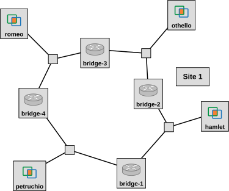

## Reserve resources

First, you will reserve a topology on GENI that includes four bridges connected in a topology with loops, with one host also connected to each network segment:

with each interface assigned an IP address as follows:

<table id="table-1" class="table table-striped table-bordered col-3" data-columns="3">
<thead>
<tr><th class="col-1">Host</th><th class="col-2">on network segment</th><th class="col-3">IP address </th></tr>
</thead>
<tbody>
<tr class="row-1"><td class="col-1">romeo</td><td class="col-2">3-4</td><td class="col-3">10.10.0.100</td></tr>
<tr class="row-3"><td class="col-1">hamlet</td><td class="col-2">1-2</td><td class="col-3">10.10.0.102</td></tr>
<tr class="row-5"><td class="col-1">othello</td><td class="col-2">2-3</td><td class="col-3">10.10.0.104</td></tr>
<tr class="row-5"><td class="col-1">petruchio</td><td class="col-2">1-4</td><td class="col-3">10.10.0.106</td></tr>
</tbody>
</table>

In the GENI Portal, create a new slice, then click "Add Resources". Scroll down to where it says "Choose RSpec" and select the "URL" option, the load the RSpec from the URL: [https://raw.githubusercontent.com/ffund/tcp-ip-essentials/gh-pages/lab-stp/stp.xml](https://raw.githubusercontent.com/ffund/tcp-ip-essentials/gh-pages/lab-stp/stp.xml)

In the Portal, there will be warning indicators on the canvas alerting you that a duplicate IP address is assigned. You can ignore this warning - we are deliberately assigning an IP address of 0.0.0.0 (i.e., no IP address) to each bridge interface. Since a bridge does not originate any Layer 3 packets, it does not need an IP address.

Click on "Site 1" and choose an InstaGENI site to bind to. (There have been some reports that this experiment does not work at the Illinois InstaGENI site; I recommend avoiding that one.) Then reserve your resources. Wait for your nodes to boot up (they will turn green in the canvas display on your slice page in the GENI portal when they are ready).

