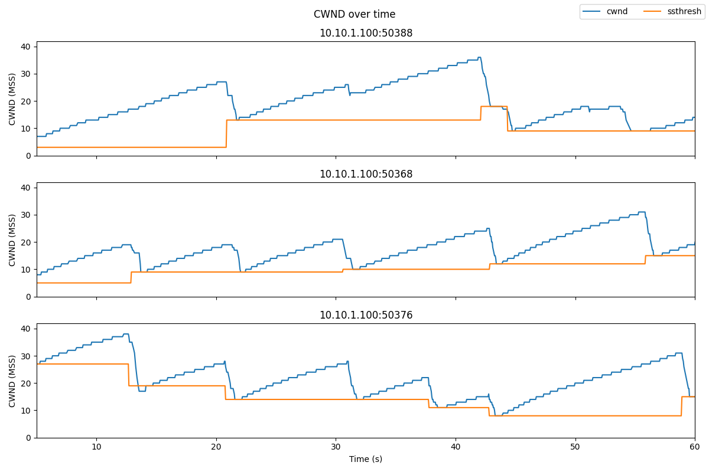

## TCP congestion control

This experiment shows the basic behavior of TCP congestion control. You'll see the classic "sawtooth" pattern in a TCP flow's congestion window, and you'll see how a TCP flow responds to congestion indicators.

It should take about 1 hour to run this experiment.


### Background

TCP is arguably one of the most important Internet protocols, as it carries a much higher volume of traffic on the Internet than any other transport-layer protocol.

Because TCP carries so much traffic, its congestion control algorithm is the main technique which prevents the Internet from slowing to a crawl due to over-utilization. This is a state known as *congestion collapse*, and occurs when the link is "busy" but not getting useful work done - for example, if the network is clogged with unnecessary retransmissions of lost packets.

In fact, an Internet collapse *has* occurred in the past, due to insufficient congestion control. A [1988 paper by Van Jacobson explains](https://doi.org/10.1145/52325.52356):

> In October of '86, the Internet had the first of what became a series of 'congestion collapses.' During this period, the data throughput from LBL to UC Berkeley (sites separated by 400 yards and three IMP hops) dropped from 32 Kbps to 40 bps.

The effective throughput (the volume of useful data transferred over the link) dropped by a factor of ~1000!

Because TCP congestion control is so essential, it is also continuously undergoing improvement and refinement. As the Internet (and the characteristics of Internet traffic) changes, TCP congestion control must evolve along with it. However, in this experiment, we'll examine an early variant of TCP congestion control that uses a basic *additive increase, multiplicative decrease* rule.


#### AIMD: additive increase, multiplicative decrease

Additive-increase/multiplicative-decrease (AIMD) is a feedback control algorithm that is the primary mechanism for adjusting the rate of a TCP flow, i.e. answering the question "How fast should I send?"

The basic idea of congestion control is that the sender transmits TCP packets on the network, then reacts to observable events to either increase or decrease its sending rate. If it believes the network is over-utilized, then it should decrease its sending rate; if it believes the network is under-utilized, then it should increase its sending rate. 

There are various indicators of congestion that can signal that the network is over-utilized. Packet loss is one such indicator. When a sender transmits TCP packets at rate faster than the capacity of the *bottleneck* (the link with the smallest capacity in the path), the bottleneck router puts packets in a buffer. As the sender continues to transmit faster than packets can leave the buffer, the buffer will fill with packets until eventually there is no room for more packets. When the buffer is full, the router has no choice but to drop new packets as they arrive. The sender will realize that packets are lost when no ACK is received for them, and it will reduce its sending rate.

How does the sender reduce its sending rate? Most congestion control algorithm use a *congestion window* (CWND) to control sending rate. For each connection, TCP maintains a CWND that limits the total number of unacknowledged packets that may be in transit end-to-end ("bytes in flight"). In other words: if the number of unacknowledged segments is equal to the CWND, the sender stops sending data until more acknowledgements are received. 

The CWND is not advertised or exchanged between the sender and receiver - it is a private value maintained locally by each end host. You can not find the CWND by inspecting packet headers.

When a connection is set up, the CWND is set to a small multiple of the maximum segment size (MSS) allowed on that connection. On modern Linux kernels, the initial CWND is 10 MSS. (Earlier versions used 4 MSS.)

The basic AIMD algorithm then goes as follows, assuming that packet loss is used as an indicator of congestion:

* **Additive increase**: Increase the CWND by a fixed amount (e.g., one MSS) every round-trip time (RTT) that no packet is lost.
* **Multiplicative decrease**: Decrease the congestion window by a multiplicative factor (e.g., 1/2) every RTT that a packet loss occurs.


Sending rate is not controlled entirely by the CWND, since TCP uses *flow control* in addition to *congestion control*. Flow control limits the number of unacknowledged segments according to the receive window size advertised by the receiver in packet headers. The rule is then: the maximum amount of data that may be in flight (i.e., not acknowledged) from the sender to the receiver is the minimum of the advertised receive window size (RWND) and CWND.

#### Slow start

The pattern described above helps avoid over-utilization. However, under AIMD, it can take some time for a flow to actually reach link capacity, causing under-utilization of the link. Slow start was introduced to help TCP flows reach link capacity faster.

Slow start is in effect during the *congestion control* phase. During congestion control, CWND is increased by the number of segments acknowledged each time an ACK is received. This is exponential growth, rather than the slower linear growth of AIMD during the congestion avoidance phase. The congestion control phase continues until a loss event occurs, or until a *slow start threshold* is reached. 

Once the slow start threshold is reached (or a packet loss is detected), then the TCP flow enters the congestion avoidance phase. At this point, AIMD kicks in and the CWND of the flow grows linearly.

How is the slow start threshold set? The slow start threshold is initialized to a large value at the beginning of the connection. Once the first loss event occurs, the slow start threshold is set to half of the CWND at the time of the loss event. 

#### Fast recovery


We mentioned that TCP can use an ACK timeout to detect lost segments. However, this means that a sender may not know that a segment is lost for a long time! Duplicate acknowledgements are an earlier indication of congestion. 

Recall that an ACK indicates the sequence number of the last in-order byte of data received. When a segment X is lost but subsequent segments X+1, X+2, X+3, etc. are delivered successfully, the receiver will send an ACK for each subsequent segment. But the sequence number in the ACK of X+1, X+2, X+3, etc. will reflect the last segment that was received in order - the sequence number of X-1! Thus, the TCP sender will get "duplicate ACKs" - multiple ACKs with the same sequence number - and can conclude that the following segment was dropped.

In TCP Reno, the CWND decrease depends on whether congestion was detected by an ACK timeout or by receipt of duplicate ACKs:

* When there is an ACK timeout, the congestion is considered severe, since subsequent segments after the first dropped segment are also not getting through. TCP Reno reduces its CWND to a minimum value, and enters slow start.
* When congestion is detected by the receipt of duplicate ACKs, the congestion is considered less severe. TCP Reno reduces its CWND to the slow start threshold, and enters congestion avoidance. This is known as "fast recovery".


#### Overview of TCP phases

The following image illustrates the behavior of TCP in congestion control (slow start) mode and congestion avoidance mode.


<i>Image is GPLv3, via [Wikimedia Commons](https://commons.wikimedia.org/wiki/File:TCP_Slow-Start_and_Congestion_Avoidance.svg).</i>


#### Animation

The animation at [this link](https://witestlab.poly.edu/respond/sites/genitutorial/files/tcp-aimd.ogv) shows AIMD congestion control at work in a network with a buffering router sitting between two hosts. Data (in blue) flows from the sending host at the left to the receiving host at the right; acknowledgements (in red) return over the reverse link. Utilization on the bottleneck link (from the router to the receiver) is noted. The plot at the bottom shows the sender congestion window as a function of time.


As the congestion window increases, the rate at which (blue) packets are sent also increases, until the bottleneck link utilization reaches 100%. Then, as the rate of packets sent continues to increase, packets start to accumulate in the buffer. Eventually, the buffer becomes full and the router must drop new packets. 

When the sender becomes aware of the dropped packet (because no ACK is received for it), it reduces its congestion window by a multiplicative factor. With a smaller congestion window, and many unacknowledged packets already "in flight", it must pause before it can resume transmission, so the buffer has a chance to drain. Once some time passes, and more of the "in flight" segments are acknowledged, the sender can resume transmission and begin to increase its congestion window again. This process continues for the lifetime of the flow, leading to a classic "sawtooth" pattern.

<i>Animation Source: Guido Appenzeller and Nick McKeown, [Router Buffer Animations](http://guido.appenzeller.net/anims/)</i>

### Results

In this experiment, we will send three TCP flows through a bottleneck link, and see the classic "sawtooth" pattern of the TCP congestion window (blue line) and slow start threshold (orange line)



<small><i>Figure 1: Congestion window size (blue line) and slow start threshold (orange line) of three TCP flows sharing the same bottleneck.</i></small>

We may also identify (if they occur in our experiment):

* "Slow start" periods, where the congestion window increases rapidly.
* "Congestion avoidance" periods (when the congestion window increases linearly from than the slow start threshold)
* Instances where duplicate ACKs were received, if any. We are using TCP Reno, which will enter "fast recovery" if it detects congestion by duplicate ACKs. The slow start threshold is set to half of the CWND at the time of the loss event, the new CWND is set to the slow start threshold, and the flow enters "congestion avoidance" mode.
* Instances of ACK timeout, if any. This will cause the congestion window to go back to a minimum value, and the flow enters "slow start" mode.

For example, the following annotated image shows a short interval in one TCP flow:


<small><i>Figure 2: Events in a TCP flow. Slow-start periods are marked in yellow; congestion avoidance periods are in purple. We can also see when indicators of congestion occur: instances of timeout (red), and instances where duplicate ACKs are received (blue) triggering fast recovery (green).</i></small>


### Set up experiment


On the end hosts ("romeo" and "juliet"), install the `iperf` network testing tool, with the command 

```
sudo apt update
sudo apt -y install iperf3
```

On romeo, we'll also install the `moreutils` utility, which will help us with data collection, and some other tools for data visualization:

```
sudo apt -y install moreutils python3-pip
```

and

```
sudo python3 -m pip install pandas matplotlib
```


and configure an additional setting:

```
sudo sysctl -w net.ipv4.tcp_no_metrics_save=1
```

Now, we will configure the "router" node. Run the following commands in an SSH session on the "router" to configure it as a 1 Mbps bottleneck, with a buffer size of 0.1 MB, in both directions:

```
sudo tc qdisc del dev eth1 root
sudo tc qdisc add dev eth1 root handle 1: htb default 3
sudo tc class add dev eth1 parent 1: classid 1:3 htb rate 1Mbit
sudo tc qdisc add dev eth1 parent 1:3 handle 3: bfifo limit 0.1MB

sudo tc qdisc del dev eth2 root
sudo tc qdisc add dev eth2 root handle 1: htb default 3
sudo tc class add dev eth2 parent 1: classid 1:3 htb rate 1Mbit
sudo tc qdisc add dev eth2 parent 1:3 handle 3: bfifo limit 0.1MB
```


Don't worry if you see a message in the output that says

```
Error: Cannot delete qdisc with handle of zero.
```

This is normal, and not a problem!

### Using `ss` to observe TCP socket statistics

The parameters of the TCP congestion control algorithm, such as congestion window and slow start threshold, are *not* included in any packet header, since these are used only on the sender side. Therefore, we can't see the details of the congestion control by monitoring packets in `tcpdump` or other packet capture tools.

Instead, we will use `ss`, a linux utility used to monitor local sockets and display socket statistics. In this section, we'll see what the `ss` output looks like, and what useful information it includes.

On the "juliet" host, set up an `iperf3` server with

```
iperf3 -s  -1
```

On the "romeo" host, initiate a connection to the `iperf3` server on "juliet" and send data using TCP Reno congestion control, for 60 seconds, with

```
iperf3 -c juliet -t 60 -C reno
```

While `iperf3` is still sending traffic, open another SSH session on "romeo" and run

```
ss -ein dst 10.10.2.100
```

Here, we use `ss` with some key arguments:

* `-e` to show detailed socket information
* `-i` to show internal TCP information. This information is known only to the operating system at the sender side; it is not sent over the network or otherwise shared with the receiver.
* `-n` specifies that it should not try to resolve names, but should show numeric values (i.e. IP addresses and not hostnames)
* `dst 10.10.2.100` is a filter that says it should only show sockets with the remote address 10.10.2.100 (the address of "juliet")


You can learn more about `ss` arguments with `man ss` or by visiting the online [man page](https://linux.die.net/man/8/ss). 


The output of this command will look something like this, although the exact details will vary:

```
Netid     State      Recv-Q      Send-Q            Local Address:Port             Peer Address:Port                                                                                                               
tcp       ESTAB      0           343176              10.10.1.100:49112             10.10.2.100:5201       timer:(on,1.204ms,0) uid:20001 ino:386735 sk:3b <->
	 ts sack reno wscale:7,7 rto:1212 rtt:833.978/7.108 mss:1448 pmtu:1500 rcvmss:536 advmss:1448 cwnd:66 ssthresh:35 bytes_acked:589374 segs_out:557 segs_in:273 data_segs_out:555 send 916.7Kbps lastsnd:8 lastrcv:5016 lastack:8 pacing_rate 1.2Mbps delivery_rate 942.8Kbps busy:4972ms rwnd_limited:96ms(1.9%) unacked:71 retrans:2/76 lost:2 sacked:5 rcv_space:14480 rcv_ssthresh:64088 notsent:240368 minrtt:0.483
tcp       ESTAB      0           0                   10.10.1.100:49110             10.10.2.100:5201       uid:20001 ino:386734 sk:3c <->
	 ts sack cubic wscale:7,7 rto:208 rtt:5.598/9.458 ato:40 mss:1448 pmtu:1500 rcvmss:536 advmss:1448 cwnd:10 bytes_acked:144 bytes_received:4 segs_out:8 segs_in:7 data_segs_out:3 data_segs_in:3 send 20.7Mbps lastsnd:5020 lastrcv:4972 lastack:4972 pacing_rate 41.4Mbps delivery_rate 9.2Mbps busy:48ms rcv_space:14480 rcv_ssthresh:64088 minrtt:0.723
```

We have two TCP sockets with the specified destination address. One is a socket used to share `iperf3` control information with the receiver. The other is a socket that carries the actual data between the sender and receiver. You can tell which one is which by looking at the `data_segs_out` value - the control flow only sends a few data segments, but the data flow will transfer hundreds or thousands of segments. In this case, the first lines in the `ss` output show the data flow, and the last lines show the control flow.

Also note that the data flow uses TCP Reno, as we specified in the `iperf3` arguments. The control flow uses whatever congestion control is the system default - here, it's TCP Cubic.

In the `ss` output for the data flow, see if you can find:

* the current CWND of this flow. This is shown in units of MSS.
* the slow start threshold of this flow. This is shown in units of MSS. The slow start threshold field, `ssthresh`, will only appear in the `ss` output once the flow has entered the congestion avoidance phase.
* the number of retransmitted segments. This will only appear in the `ss` output once there has been a retransmission in the lifetime of the flow. If it appears in the output, it will show two values: the number of currently unacknowledged retransmitted segments, and the total (cumulative) number of retransmissions for the flow.


### Generating data

Next, we will generate some TCP flows between the two end hosts, and use it to observe the behavior of the TCP congestion control algorithm.

While the TCP flows are running, we will also run a script that repeatedly runs `ss` and redirects the output to a file. When you press Ctrl+C, it will stop running the `ss` command and process the raw output into a format that is more convenient for data analysis and visualization.

Download this script on the "romeo" host with


```
wget -O ss-output.sh https://raw.githubusercontent.com/ffund/tcp-ip-essentials/gh-pages/scripts/ss-output.sh
```

On the "juliet" host, run

```
iperf3 -s -1
```

In a terminal on the "romeo" host, run

```
bash ss-output.sh 10.10.2.100
```

In a second terminal on the "romeo" host, run

```
iperf3 -c juliet -P 3 -t 60 -C reno
```

Here

* `-t 60` says to run for 60 seconds
* `-c juliet` says to send traffic to the host named "juliet"
* `-P 3` says to send 3 parallel TCP flows
* `-C reno` says to use TCP Reno for the data flows


While `iperf3` is running, you will see periodic updates in the `iperf3` window,  and a continuous flow of socket statistics data in the `ss` window. After about a minute, you will see a final status report in the `iperf3` window, and the `iperf3` process will finish. Then, use Ctrl+C to stop the `ss` script in the other window. Pressing Ctrl+C once will cause the script to process the raw data, and then exit.  

If you run `ls` on the "romeo" host, you should see two files generated by the `ss` script:

* `sender-ss.txt` is the raw output - the complete output of the `ss` command each time it was executed by the script.
* `sender-ss.csv` is a processed output - the script parsed the raw output, for each line of output, it prints the following comma-separated columns, in order, for each row of output:
  * Timestamp (in [Unix time](https://en.wikipedia.org/wiki/Unix_time) format)
  * TCP sender, in IP:Port format. Each of the TCP flows in this experiment will use a different local port number, and the control flow will use a unique local port number as well. We'll use this field to distinguish the flows.
  * Number of currently unacknowledged retransmissions for this flow.
  * Cumulative number of retransmissions for this flow.
  * Current CWND of this flow.
  * Current slow start threshold of this flow.

You can transfer these files to your laptop with `scp`. 


### Visualization

You can use your preferred data visualization tool or programming language to analyze the results of your experiment. (Make sure to exclude the control flow from your analysis!) 

For convenience, I share a Python script here, but you are not required to use this - you can use any tool you like to plot this data.

This script assumes that you have retreived the `sender-ss.csv` data file to the same directory that you run this script from. Then, it will save an image as `sender-ss.png`.

```python
import pandas as pd
import matplotlib.pyplot as plt

df = pd.read_csv("sender-ss.csv", names=['time', 'sender', 'retx_unacked', 'retx_cum', 'cwnd', 'ssthresh'])

# exclude the "control" flow
s = df.groupby('sender').size()
df_filtered = df[df.groupby("sender")['sender'].transform('size') > 100]
start_time = 5
time_min = df_filtered.time.min()
cwnd_max = 1.1*df_filtered[df_filtered.time - time_min >=start_time].cwnd.max()

senders = df_filtered.sender.unique()

dfs = [df_filtered[df_filtered.sender==senders[i]] for i in range(3)]

fig, axs = plt.subplots(len(senders), sharex=True, figsize=(12,8))
fig.suptitle('CWND over time')
for i in range(len(senders)):
    if i==len(senders)-1:
        axs[i].plot(dfs[i]['time']-time_min, dfs[i]['cwnd'], label="cwnd")
        axs[i].plot(dfs[i]['time']-time_min, dfs[i]['ssthresh'], label="ssthresh")
        axs[i].set_xlabel("Time (s)");
    else:
        axs[i].plot(dfs[i]['time']-time_min, dfs[i]['cwnd'])
        axs[i].plot(dfs[i]['time']-time_min, dfs[i]['ssthresh'])
    axs[i].title.set_text(senders[i])
    axs[i].set_ylim([0,cwnd_max])
    axs[i].set_ylabel("CWND (MSS)");
    axs[i].set_xlim([start_time,60])


plt.tight_layout();
fig.legend(loc='upper right', ncol=2);
plt.savefig("sender-ss.png")
```

If you prefer, you can generate this plot directly on the "romeo" host and then download it with `scp`. Open the Python terminal on "romeo" by running:

```
python3
```

Then, copy the script above into this terminal and hit Enter to make sure it runs completely. Type `exit()` and hit Enter to exit the Python terminal.

Run 

```
ls
```

and you should see that it generated an image file named `sender-ss.png`. Transfer this file to your computer with `scp`.

The results will look something like this:


<small><i>Figure 1 (same as Figure 1 in Results section): Congestion window size (blue line) and slow start threshold (orange line) of three TCP flows sharing the same bottleneck.</i></small>

Note that this visualization omits the first few second of each flow. Because the scale of the CWND in the initial slow start phase can grow so much bigger than the CWND during the congestion avoidance phase, it's not very practical to visualize them both on the same plot. We'll look at the initial slow start phase separately. 

Here's a Python script to visualize the first few second of the experiment - it will create a file `sender-ss-start.png`:

```python
import pandas as pd
import matplotlib.pyplot as plt

df = pd.read_csv("sender-ss.csv", names=['time', 'sender', 'retx_unacked', 'retx_cum', 'cwnd', 'ssthresh'])

# exclude the "control" flow
s = df.groupby('sender').size()
df_filtered = df[df.groupby("sender")['sender'].transform('size') > 100]

senders = df_filtered.sender.unique()

time_min = df_filtered.time.min()
dfs = [df_filtered[df_filtered.sender==senders[i]] for i in range(3)]

fig, axs = plt.subplots(len(senders), sharex=True, figsize=(12,8))
fig.suptitle('CWND over time')
for i in range(len(senders)):
    if i==len(senders)-1:
        axs[i].plot(dfs[i]['time']-time_min, dfs[i]['cwnd'], label="cwnd")
        axs[i].plot(dfs[i]['time']-time_min, dfs[i]['ssthresh'], label="ssthresh")
        axs[i].set_xlabel("Time (s)");
    else:
        axs[i].plot(dfs[i]['time']-time_min, dfs[i]['cwnd'])
        axs[i].plot(dfs[i]['time']-time_min, dfs[i]['ssthresh'])
    axs[i].title.set_text(senders[i])
    axs[i].set_ylabel("CWND (MSS)");
    axs[i].set_xlim([0, 5])


plt.tight_layout();
fig.legend(loc='upper right', ncol=2);
plt.savefig("sender-ss-start.png")
```

Note the *very* large range of the vertical axis in this plot!

Considering both plots, we can now begin to understand the CWND behavior of the TCP flow. At the beginning of each flow, it operates in slow start mode, where the congestion window increases exponentially. When a congestion event occurs, as indicated by the receipt of multiple duplicate ACKs, the slow start threshold is set to half of the current CWND, and then the CWND is reduces to the slow start threshold.

We'll often see packet losses occur at the same time in multiple flows sharing a bottleneck (as in the figure above), because when the buffer is full, new packets arriving from all flows are dropped.


**Lab report**: Create a plot of the congestion window size and slow start threshold for each TCP flow over the duration of the experiment, similar to Figure 1 in the [Results](#results) section. Also create a similar plot of the first few seconds of the experiment.

For *one* flow, annotate both plots, similar to Figure 2 in the [Results](#results) section, to show:

* Periods of "Slow Start" 
* Periods of "Congestion Avoidance"
* Instances where multiple duplicate ACKs were received (which will trigger "fast recovery")
* Instances of timeout (if any)

Using your plot and/or experiment data, explain how the behavior of TCP is different in the "Slow Start" and "Congestion Avoidance" phases. Also, using your plot, explain what happens to both the congestion window and the slow start threshold when multiple duplicate ACKs are received.


### Additional exercises: other congestion control algorithms

In the decades since TCP Reno was first proposed, several other congestion control algorithms have been developed that offer improved performance in some circumstances.

You can repeat this experiment with other congestion control variants by changing the value of the `-C` argument in `iperf3`. 

First, make sure to save the data from the main part of this experiment. When you run the experiment again (with a different control control algorithm), it will overwrite your previous data, so you want to have that safely stored somewhere else first.

For example, you could run this experiment with TCP Cubic, which is the current default on Linux servers that power much of the Internet. The main difference between TCP Reno and TCP Cubic is the window increase function. While Reno uses the traditional linear increase (W=W+1), Cubic implements a binary search increase which can reach the available bandwidth much faster than Reno. You may read more about Cubic in the [TCP Cubic paper](https://www.cs.princeton.edu/courses/archive/fall16/cos561/papers/Cubic08.pdf).

To run the experiment with TCP Cubic, you would repeat the steps in the [Generating Data](#generatingdata) section above, but with the `iperf3` command

```
iperf3 -c juliet -P 3 -t 60 -C cubic
```

on "romeo".

The results will look something like this:


Notice that unlike Reno, the window size does not increase as a linear function of the time since the last congestion event! Instead, the window size is a cubic function of the time since the last congestion event.

### Additional exercises: low delay congestion control


While TCP CUBIC and Reno are designed with the goal of high throughput, they tend to cause high queuing delays in the network, because they reduce their CWND only when they experience a packet loss, i.e. when the queue is full. A full queue means long queuing delays for packets that traverse the queue! 

Some congestion control variants use delay as a signal of congestion, and reduce their sending rate when the delay increases (indicating that the queue is becoming full). An early example is TCP Vegas. You can see this for yourself with a simple experiment to measure the queuing delay with a loss-based congestion control (like Reno or Cubic) and with a delay-based congestion control (Vegas).

For this experiment we will use `iperf3` and `ping` at the same time - `iperf3` to generate a TCP flow, and `ping` to estimate the queuing delay induced by the TCP flow.  With an `iperf3` server running on juliet, in one terminal on romeo run

```
iperf3 -c juliet -t 60 -C reno
```

and at the same time, in a second terminal on romeo, run

```
ping juliet -c 50
```

(the `ping` should both start and finish while the `iperf3` sender is still running). When it finishes, make a note of the `iperf3` throughput and the round trip time estimated by `ping` during the TCP Reno flow.

Then, repeat with Vegas, the delay-based congestion control algorithm. With an `iperf3` server running on juliet, in one terminal on romeo run

```
sudo modprobe tcp_vegas
sudo iperf3 -c juliet -t 60 -C vegas
```

and at the same time, in a second terminal on romeo, run

```
ping juliet -c 50
```

Make a note of the `iperf3` throughput and the round trip time estimated by `ping` during the TCP Vegas flow.

One problem with TCP Vegas is that it does not work well when it shares a bottleneck link with a TCP Reno flow (or other loss-based flow). To see how this works, we will send two TCP flows through the bottleneck router: one TCP Reno flow, and one TCP Vegas flow.

We will need two `iperf3` servers running on juliet, on two different ports. In one terminal on juliet, run

```
iperf3 -s -1
```

to start an `iperf3` server on the default port 5201, and in a second terminal on juliet, run


```
iperf3 -s -1 -p 5301
```

to start an `iperf3` server on port 5301.

You'll need two terminal windows on romeo. In one of them, run

```
sudo iperf3 -c juliet -t 60 -C vegas
```

and a few seconds afterwards, in the second, run

```
iperf3 -c juliet -t 60 -C reno -p 5301
```

Make a note of the throughput reported by `iperf3` for each flow.

### Additional exercises: TCP BBR

A more recent congestion control proposed by Google, called TCP BBR, tries to maximize throughput and at the same time minimize queuing delay in the network. You can read more about it in the [TCP BBR paper](https://research.google/pubs/pub45646/).

To use the BBR congestion control for your experiment, on romeo, run

```
sudo modprobe tcp_bbr
```

This will load the Linux kernel module for TCP BBR. 

Then, repeat the other steps in the [Generating Data](#generatingdata) section above, but with the `iperf3` command

```
iperf3 -c juliet -P 3 -t 60 -C bbr
```

on "romeo".

BBR doesn't use a slow start threshold, so you won't be able to use the same data visualization script (which assumes that there will be an `ssthresh` field in the data), but you can create a similar plot on your own. The results will look something like this:


Note that BBR overall maintains a lower CWND than Cubic or Reno, because it wants to minimize queue occupancy. But you'll see in the `iperf3` output that it still achieves a similar throughput (about 1Mbps total shared between the 3 flows). Also, if you look at the raw `ss` data for the BBR and the Reno/Cubic flows, you'll note that the BBR flows see a much lower RTT, since they do not fill the queue.

### Additional exercises: Explicit congestion notification (ECN)

Finally, we'll try an experiment with explicit congestion notification. Explicit congestion notification (ECN) is a feature that allows routers to explicitly signal to a TCP sender when there is congestion. This allows the sender to reduce its congestion window *before* the router is forced to drop packets, reducing retransmissions. It can also help the router maintain a minimal queue, which reduces queuing delay.

ECN involves both layer 2 and layer 3, and it requires support from both transport layer endpoints (sender *and* receiver) and routers along the path traversed by the packets.

We will use ECN together with active queue management, which monitors the queuing delay. At the router, configure a queue in both directions that will mark packets when the queuing delay exceeds 10ms:

```
sudo tc qdisc del dev eth1 root  
sudo tc qdisc add dev eth1 root handle 1: htb default 3  
sudo tc class add dev eth1 parent 1: classid 1:3 htb rate 1Mbit  
sudo tc qdisc add dev eth1 parent 1:3 handle 3:  codel limit 100 target 10ms ecn

sudo tc qdisc del dev eth2 root  
sudo tc qdisc add dev eth2 root handle 1: htb default 3  
sudo tc class add dev eth2 parent 1: classid 1:3 htb rate 1Mbit  
sudo tc qdisc add dev eth2 parent 1:3 handle 3:  codel limit 100 target 10ms ecn
```


On romeo and juliet, enable ECN in TCP by running

```
sudo sysctl -w net.ipv4.tcp_ecn=1   
```


Next, we'll prepare to capture the TCP flow. On both end hosts, romeo *and* juliet, run:

```
sudo tcpdump -s 80 -i eth1 'tcp' -w $(hostname -s)-tcp-ecn.pcap
```

ECN uses two flags in the TCP header: the ECN Echo (ECE) flag, and the Congestion Window Reduced (CWR) flag. It also uses two ECN bits in the DiffServ field of the IP header. Here is how these header fields are used:

* During the connection establishment phase of TCP, both endpoints indicate to the other that they support ECN. First, one host sends an ECN-setup SYN packet: it sets the ECE and CWR flags in the TCP header of the SYN. Then, the other host response with an ECN-setup SYN-ACK packet: it sets the ECE flag (but not the CWR flag) in the TCP header of the SYN-ACK.
* In any subsequent packets that carry data (not pure ACKs!), the sender will set the two ECN bits in the IP header to either 10 or 01. Either of these flag values will indicate to the routers along the path that this data packet uses an ECN-capable transport. 
* If the router wants to signal to the TCP sender that there is congestion - for example, if the queue at the router is starting to fill up - then it sets the two ECN bits in the IP header to 11 before forwarding the packet to the destination. This is a "Congestion Experienced" signal.
* If the receiver gets a data packet with the CE signal (the ECN bits in the IP header are set to 11), the receiver will set the ECN-Echo (ECE) flag in the TCP header *of the ACK* for that packet.
* When the sender gets the ACK with the ECE flag set, it will reduce its CWND. Then it will set the Congestion Window Reduced (CWR) flag in the TCP header of the  next packet.


With the `tcpdump` running, we can now run the experiment. In a second terminal on juliet, run

```
iperf3 -s -1
```

In a second terminal on romeo, run

```
iperf3 -c juliet -t 60 -C reno
```

and finally, in a third terminal on romeo, run

```
ping -c 50 juliet
```

When the experiment finishes, compare the delay performance of Reno with ECN (this experiment) to your previous experiment showing the delay performance without ECN.


Also, transfer the packet captures to your laptop with `scp`, and look for the ECN-related fields in the IP header and TCP header, during connection establishment and during data transfer.
