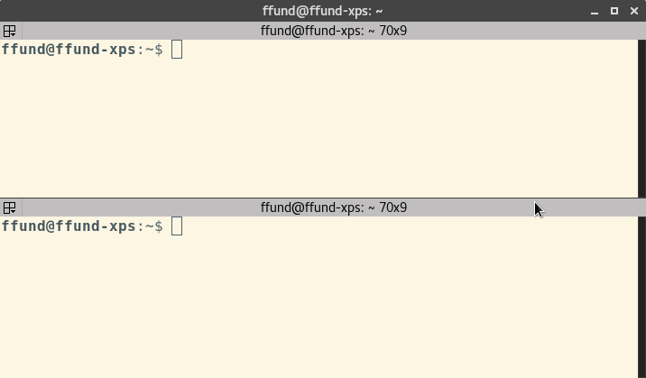

## 1.0 Prepare your workstation

You'll need to prepare your workstation with all the software necessary to complete the lab assignments in this course.

### Terminal software

The primary software application you'll need is a terminal, which you will use to log in to remote hosts over SSH and carry out various exercises.

You may have a terminal application already on your workstation, but it may not be ideal for this course. To complete these lab exercises, you will often have to run and monitor the output of multiple commands in several independent terminal sessions, all at the same time, like this:

It is therefore *strongly recommended* to use a terminal that lets you split one terminal window into multiple parts - for example,

* [cmder](http://cmder.net/) for Windows
* [terminator](https://launchpad.net/terminator) for Linux
* [iTerm2](https://www.iterm2.com/) for Mac

Once you have downloaded and installed your terminal application, open it up and try to become familiar with its usage. In particular, you need to learn:

* How to split the pane in your terminal.
* How to copy text from your terminal and paste into another application
* How to copy text from another application and paste into your terminal

#### Terminator for Linux

If you are using terminator on Linux, you can split the pane either vertically or horizontally as follows:

1. Right-click anywhere inside the terminal window
2. Choose "Split pane horizontally" or "Split pane vertically"
