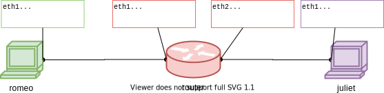

## 0.3 Inspect network interfaces

### Exercise 8

Make sure you have a terminal window logged in to each host - romeo, juliet, and the router. Then, run

```
ifconfig -a
```

on each host in your topology, and examine the output.


```
eth0      Link encap:Ethernet  HWaddr 02:0d:1e:c3:c3:dc  
          inet addr:172.17.1.33  Bcast:172.31.255.255  Mask:255.240.0.0
          inet6 addr: fe80::d:1eff:fec3:c3dc/64 Scope:Link
          UP BROADCAST RUNNING MULTICAST  MTU:1500  Metric:1
          RX packets:17561 errors:0 dropped:0 overruns:0 frame:0
          TX packets:14740 errors:0 dropped:0 overruns:0 carrier:0
          collisions:0 txqueuelen:1000 
          RX bytes:11047161 (11.0 MB)  TX bytes:1175202 (1.1 MB)

eth1      Link encap:Ethernet  HWaddr 02:d8:ce:5b:bc:45  
          inet addr:10.0.0.2  Bcast:10.0.0.255  Mask:255.255.255.0
          inet6 addr: fe80::d8:ceff:fe5b:bc45/64 Scope:Link
          UP BROADCAST RUNNING MULTICAST  MTU:1500  Metric:1
          RX packets:44 errors:0 dropped:0 overruns:0 frame:0
          TX packets:20 errors:0 dropped:0 overruns:0 carrier:0
          collisions:0 txqueuelen:1000 
          RX bytes:3476 (3.4 KB)  TX bytes:1858 (1.8 KB)

lo        Link encap:Local Loopback  
          inet addr:127.0.0.1  Mask:255.0.0.0
          inet6 addr: ::1/128 Scope:Host
          UP LOOPBACK RUNNING  MTU:65536  Metric:1
          RX packets:127 errors:0 dropped:0 overruns:0 frame:0
          TX packets:127 errors:0 dropped:0 overruns:0 carrier:0
          collisions:0 txqueuelen:1 
          RX bytes:7644 (7.6 KB)  TX bytes:7644 (7.6 KB)
```


On romeo and juliet, we note two Ethernet interfaces (named `eth0` and `eth1`) and a loopback interface (named `lo`). The loopback interface is a virtual network interface that the computer uses for processes on the same host to communicate with one another using network protocols. The two Ethernet interfaces represent two points of attachment to networks.  On the router node, you'll see three Ethernet interfaces, representing three points of attachment to networks.

Why do we have multiple points of attachment? Every host we reserve on GENI will have a "control" interface connected to the public Internet, that we use to SSH into the VM to run commands. In addition to the "control" interface, it can also have experiment interfaces (one for each link that we connect to the host, when setting it up in the GENI Portal, and with IP address and netmask according to what we configured in the Portal). In our lab experiments, we will send traffic over the "experiment" interfaces. The "control" interface will be used strictly for logging in to the hosts.

You can distinguish the "control" and "experiment" interfaces by their IP addresses; the experiment interfaces have whatever IP addresses you assigned to them in the GENI Portal. The IP address of the control interface is assigned by the host site, not by you.

**Lab report**: Show the output of `ifconfig -a` for each host in _your_ topology: romeo, juliet, and the router. Make sure you show which output comes from which host. Also, for each, indicate the name of the "control" interface (e.g. `eth0`, `eth1`, `eth2`) and the name of each "experiment" interface, and explain how you can tell which is which.

### Exercise 9 - Create a network diagram

When you reserve a network topology on GENI, you will control the IP address assigned to each experiment interface. However, the MAC address of the interface will be different each time. On a host with multiple experiment interfaces, the name of the interface (e.g. `eth1`, `eth2`) can also vary. 

You can document these details in the form of a network diagram, on which you will:

* Draw a connectivity diagram that shows each host and which hosts it is directly connected to.
* Label each host with its hostname.
* Label each "experiment" network interface with the name assigned to it by the OS, e.g. `eth1`, `eth2`.
* Label each "experiment" network interface with its IP address and MAC address.

A sample network diagram is shown below:



You will submit at least one network diagram like this for each lab assignment. Some lab assignments may involve more than one network topology, in which case you will submit a network diagram for each topology.

**Lab report**: Include a network diagram, as described above, for _your_ experiment. The IP address and MAC address of each interface should reflect the output of `ifconfig -a`, from the previous question. You may use any software of your choice to create this diagram, or you can draw it by hand and take a photo to include in your lab report. 

(The sample diagram shown above was created with [https://www.draw.io](https://www.draw.io). If you would like to use this software, you can create a revised version of my diagram by clicking on [this link](https://www.draw.io/?lightbox=1&highlight=0000ff&edit=_blank&layers=1&nav=1&title=1-network-diagram.xml#R5ZlLc9s2EIB%2FjY7R8E3qKMl2c0g6nnFn2p4yEAmRSECCBSFb7q%2FvAgTflM3IVGW3zgxDLIAFuPvt4qGFvU2Pv3CUJ19ZhOnCMqLjwr5ZWJYfePCUgudS4Pl2KYg5iUqR2QgeyN9YCw0tPZAIF52GgjEqSN4VhizLcCg6MsQ5e%2Bo22zPaHTVHMR4IHkJEh9LfSSQS%2FRWG0cg%2FYxInemSnqtih8EfM2SHTwy0se6%2F%2ByuoUVap0%2ByJBEXtqiezbhb3ljInyLT1uMZWWraxW9rs7UVtPm%2BNMTOng62mI5%2BrLcQSG0EXGRcJiliF620g36vOwVGBAKREphVcTXmFM%2FvyHlqvCn7KwdKviPeYkxQJz3eY7FuJZOx8dBANRM%2BQXxnKtuBCc%2FcBbRhlXk7QN9afURmvpbjnZR0RLyR2htO6JuOi1ULJWG%2Bih5%2BBVta0yFGMs6pk%2F5CgkWaw%2FoGAHHuITlaVppT1POkeLSjUaJU27GlZjV4MB4YYZDMWfoQnHFAny2NWONPhx3a7xPrxoAMZh0EODlQ5aKQclbIAIQJvL1%2FQYy%2BBfhqQI2TJkaX4AIxTfUBZ9y8EmeYI5osUShCnJlO1btESoSGqK9uCOln8jFweRM%2Bb5wNrZnlfXVMEJ9tk8Yi4IhPAXtMP0nhVEEJZB3Y4JwdJWgzUlsawQErAN0qUQvCLJ3LCDoCSDQavU0jhTasDHl905dJTuYPkQCaqPTopmlSWfWilGq01a2cV13u7b1ayBfiRCxfnSdHWxFelQ6gd6nRnMiZnhtbh%2Be%2BaYkhnOi2D3ehHsDiL4%2B4ESmIXlUZjKZsfhLRb1p%2F2rQY1NCGt%2FzCkr2B6gjxnUziq4Wkx7I%2FlaOmuib8vGhf5%2Fuh%2F3QYjDcMyPu8B1XOND%2BtHyXvejH4z40X67H0174EgsErMdtC1ven8d5O5ws2eZ%2BFSoFLiGBqaRH5Upqvoq0k1jKf%2FNpc4AI64NWJvXNkx%2Fbe7gAasLFPczjTDAF7wqunhyDHrQTjWQAOSMZEJ5wN0s3BsJDiwK5ViqQ8URxXtxErai3L79plaPT46e8h1KCZVUbCHHExldxq%2F4SVfqJcg0BsvlIDhu195G7VxmoNVcGV1arSGtZnWWSjoHlRlwHe4TAVdrTlzNeXG1wexr7Mo3BA9fPlb4f47rRQG1bfuKgA4Xxn4%2B7aRGa1ijsMF7eDgyyyFDFhU2uwl7qesS0Hbyi0QM92H%2BjeH7My2oQf%2B0M4aAdSkE%2FFdzVCfdnEIgko53ZPqQdln7UoaC%2FzACay8wNsFMe2NvQhK4GAGrAQEDJ7VOmRnLcNdfp4%2BOP5Vmf%2Frouzjr0FnlvPap0xn3Tsv67ojxK9nkw6ke4V7y3FoBujsU2%2B75VF%2BdlZ3aN5Q9PUFXT12u9Oj7ub4ehUf90ZOIqUh8N8RMvUY9kxh7SMyJe4qPRYzl9ZAxL4eM%2BU6Q0Rdy1eXcy7dx5%2FEykmDM62YYx3s5NUwFxl71FPXJmxEY630BYywdyAMNNOYJZJqcpK98L5eW%2FCFn7jUxq3%2Fbq%2FKScSZmjt%2FLS31FZ2MGxeYnw7J586usffsP) and then clicking on the pencil diagram near the bottom of the page. Then you can change the details in the diagram to match your own topology.)

Once you are done with this part of the lab , proceed to the [next part](1-4-working-on-remote-hosts.md)
