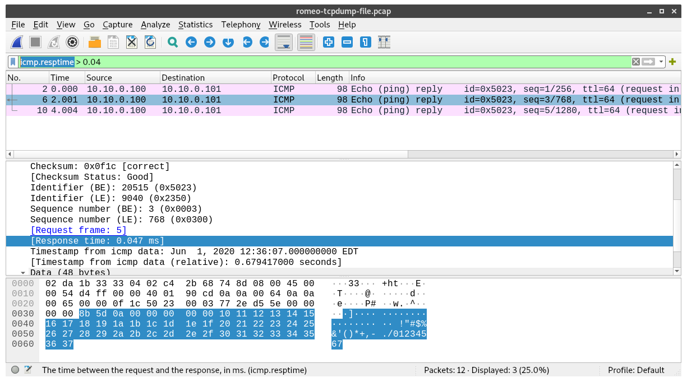

## 1.5 Using `tcpdump` and Wireshark

Finally, in this section you will practice using `tcpdump` and Wireshark, two software applications for *packet capture* and *packet analysis*. Using these applications, we can capture raw network data as it arrives at or leaves any host in our experiments, save the raw network packets in a file, and analyze the packets in this file in order to gain insight into network protocols and their behavior.

You will use these utilities in every lab exercise for the remainder of the course.

### Exercise 11 - Capture network traffic with `tcpdump`

Both Wireshark and `tcpdump` can be used to capture packets from a live network. However, `tcpdump` is a terminal-based application while Wireshark has a graphical user interface. Since we have terminal-based SSH sessions on our remote hosts, we will use `tcpdump` to capture network packets.

We will start by learning how to use `tcpdump` to capture all network packets arriving at or leaving a particular network interface. When using `tcpdump`, we will use the `-i` argument to specify the name of the interface that we want to capture traffic on. 

On the "romeo" host, run

```
tcpdump -i eth1
```

You should see an error message, similar to the following:


```
tcpdump: eth1: You don't have permission to capture on that device
(socket: Operation not permitted)
```

This is because only users with computer administrator privileges are allowed to capture raw network traffic.  On Linux, to signal to the operating system that we want to run a command with admin privileges, we preface the command with `sudo` - "superuser do". Try it now with


```
sudo tcpdump -i eth1
```

You shouldn't see any error messages this time, now that you are running `tcpdump` with the correct privileges. But you won't see any network packets, either, because there is not traffic on the network. To generate some traffic, open a second SSH session to the "juliet" host, and run

```
ping -c 5 10.10.0.100
```

while the `tcpdump` is still running on "romeo". This will generate some traffic (ICMP echo requests and replies) between the "juliet" host and the "romeo" host. You'll see a summary view of each packet in the `tcpdump` output. When the `ping` is finished, use Ctrl+C to stop the `tcpdump`. Save this output for your lab report.


### Exercise 12 - Save a packet capture to a file and analyze it in Wireshark

For most lab exercises, we will want to use `tcpdump` to capture network packets and *save them to a file* so that we can analyze them afterwards. To save a packet capture to a file, we use the `-w` argument in `tcpdump`.

Try it now - on "romeo", run

```
sudo tcpdump -i eth1 -w romeo-tcpdump-file.pcap
```

Then, while the `tcpdump` is still running on "romeo", on "juliet" run

```
ping -c 5 10.10.0.100
```

Unlike before, you won't see a summary of each packet in the `tcpdump` window on "romeo", since the output is now being saved to a file instead of being displayed on a terminal. Wait for the `ping` to finish, then press Ctrl+C to stop the `tcpdump` on romeo. When you do, it will tell you how many packets were captured, e.g.

```
12 packets captured
12 packets received by filter
0 packets dropped by kernel
```

You can quickly see the packet summaries by reading in the file with `tcpdump`, using the `-r` argument to pass the file name:


```
tcpdump -r romeo-tcpdump-file.pcap
```

(Note that you don't need special privileges to print back packet summaries from a file, only to capture live traffic from a network interface! That's why you didn't need `sudo` for this command.)

In most cases, though, you will want to do a more in-depth analysis using Wireshark on your laptop. Open a new terminal pane and use `scp` to transfer the file to your own laptop. (Note that the packet capture will be located in your home directory on the remote host, at `~/romeo-tcpdump-file.pcap`.)

Then, open Wireshark. Use File > Open to find the file and open it for further analysis. Use the example below to find the main parts of the Wireshark window:


Click on one ICMP packet to highlight it, and then explore it further in the packet detail pane. Click on the > to expand the details of the header at each layer. 

Note that as you click on a part of the analysis in the packet detail pane, the corresponding bytes from which Wireshark inferred this analysis are highlighted in the bytes pane. For example, if you click on the "Ethernet II" heading in the packet detail pane, you can see that the first 14 bytes of the packet are highlighted in the packet bytes pane:


If you click on the individual fields in the Ethernet header in the packet detail pane, you can further observe that: 

* the first 6 bytes of the packet are the destination MAC address (and since a MAC address is customarily given in hex digits, you can read it straight from the packets bytes pane), 
* the next 6 bytes are the source MAC addresss, 
* and the next 2 bytes (which are the last bytes of the Ethernet header) are the Type field. The Type field includes information about what upper layer protocol - in this case, IPv4 - is used for this packet.

Also note that when the Ethernet heading is highlighted, the status bar at the bottom shows "Ethernet (eth) 14 bytes".

In addition to the packet details that are explicit in the packet, like those mentioned above, Wireshark also displays some "generated fields" that are *inferred* from the contents of the packet capture. These fields are shown inside `[` `]` brackets in the packet detail pane.  For example, if you click on an ICMP *reply* packet and expand the ICMP section in the packet detail pane, you can see that Wireshark computes the response time, even though this is not explicit in the packet itself.


**Lab report**: Select one ICMP packet in your packet capture. In the packet detail pane, find and select the "Sequence number" field in the ICMP header. Take a screenshot showing this field highlighted in both the packet detail pane and the packet bytes pane. How many bytes are allocated for this field in an ICMP packet? Explain how you can determine the number of bytes reserved for this field, using your screenshot.


### Exercise 13 - Useful display options and capture options in `tcpdump`


In addition to the `-i` and `-w` options discussed above, there are a variety of optional arguments that you can use to change the way that `tcpdump` behaves. To explore these options, run

```
man tcpdump
```

Use Enter, the up and down arrow keys, or the Page Up and Page Down keys to page through the manual. You can use `q` to quit the man page when you are finished.

Some important options for controlling the `tcpdump` *display* include:

* `-e` is used to print the link-level header (such as MAC addresses for Ethernet packets) on each line of output.
* `-n` directs `tcpdump` not to try and resolve addresses (such as IP addresses to hostnames), but to just print the addresses directly.
* `-x` is used to print the payload of each packet (excluding its link level header) in hex digits, in addition to the summary of the packet headers.


Try running

```
sudo tcpdump -enx -i eth1
```

on "romeo". This command combines all of the options listed above, as well as the `-i` option to specify the interface to capture packets on. While this is running, generate an echo request and reply from "juliet" with

```
ping -c 5 10.10.0.100
```

Save the `tcpdump` output for your lab report.

The options above only affect what is printed to the standard output on the terminal when you run `tcpdump`. They will have no effect on a packet capture that is saved to a file using the `-w` argument.

In contrast, *capture* options determine what is captured by `tcpdump`, whether you display packet summaries in the terminal output or save packets to a file. 

One useful capture option, `-s`, is used to limit the number of bytes to capture for each packet. This is known as the *snaplen* or *snapshot length*. This option is especially useful when you are capturing network traffic that includes the transfer of a large volume of data. If you capture every packet in its entirety, your packet capture file can become very large and difficult to work with - for example, it may take a very long time to transfer back to your laptop with `scp`. Instead, you can capture just the packet headers, and the packet capture file will be much smaller.

To try this, run

```
sudo tcpdump -i eth1 -s 34 -w romeo-tcpdump-snaplen.pcap
```

on "romeo". While this is running, on "juliet" run

```
ping -c 5 10.10.0.100
```

After the `ping` finishes, use Ctrl+C to stop the `tcpdump`, and then use `scp` to transfer the packet capture to your laptop. Open it with Wireshark and observe that only the Ethernet header (14 bytes) and IP header (20 bytes) are included in each packet.

Meanwhile, on "romeo", run

```
ls -l
``` 

to list the files in your working directory, in "long" format. This format includes the size of each file. The two packet capture files include similar packets, but they have very different sizes. 

Finally, `tcpdump` also supports capture *filters*, which limit which types of packets are captured. Capture filters are listed after the other options.

Try running

```
sudo tcpdump -i eth1 src host 10.10.0.100
```

on "romeo", and on "juliet", run


```
ping -c 5 10.10.0.100
```

After the `ping` finishes, use Ctrl+C to stop the `tcpdump`. Save this output for your lab report.

You can find more information about capture filters in the [online documentation](https://www.tcpdump.org/manpages/pcap-filter.7.html).

**Lab report**: Show the output of `tcpdump` for *one* captured ICMP packet, both with and without the `-enx` options. Point out the differences in the output, and explain which option is responsible for each.

**Lab report**: Show the output of `tcpdump`, both with and without the `src host 10.10.0.100` capture filter. What is different, and why?

**Lab report**: What command would you run on the "romeo" host to capture *only* TCP traffic (and no non-TCP traffic) between "romeo" and "juliet"? Explain your answer. Try running this command while generating some traffic with `ping` between "romeo" and "juliet", and show the `tcpdump` output. Did you capture the `ping` traffic? Explain.


### Exercise 14 - Useful display options in Wireshark

Like `tcpdump`, Wireshark is a powerful application with many options and extra features included. A detailed Wireshark user guide is available at the following link: [https://www.wireshark.org/docs/wsug_html_chunked/](https://www.wireshark.org/docs/wsug_html_chunked/)

One important feature in Wireshark is the ability to use *display filters* to filter the packets that are displayed on the screen. These filters are conceptually similar to the capture filters in `tcpdump`, but they have very different syntax, and the display filters only control what is displayed, not what is captured or what is included in a file.

Open your first packet capture file in Wireshark, and try applying the display filter

```
ip.src == 10.10.0.100
```

To use a display filter, type the filter into the filter toolbar near the top of the Wireshark window, then hit "Enter". The filter toolbar background will be green if the display filter is valid. You should see that only the packets matching the criteria in the display filter are visible.

To clear the display filter and show all packets again, click on the X icon on the right side of the filter toolbar.

When a filter is applied but then you change the filter criteria, it can be difficult to tell whether the filter written in the filter toolbar is applied or not. You can check by moving your mouse over the X icon and the arrow icon on the right side of the filter toolbar. If the arrow icon turns *blue* when you mouse over it, the filter is not applied, and you can click on the blue arrow to apply it. If the filter shown in the filter toolbar is already applied, the arrow will remain gray when you move your mouse over it.

While the display filter syntax may be daunting - there are so many possible fields to filter on! - you don't need to memorize the name of any field in order to use it as a display filter. If you click on any field in the packet display pane (including generated fields that are not explicit in the packet!) the status toolbar at the bottom will show you the field name. You can then use it in a filter. 



For example (as shown here), if I click on the ICMP response time field for a packet, I can see from the status bar that the name of the field is `icmp.resptime`. Then, I can apply the filter


```
icmp.resptime > 0.04
```

to display only the packets with a response time greater than 0.04 seconds.

You can also apply a filter directly from the packet detail pane. For example, right-click on the destination MAC address in any packet, and you will see an "Apply as filter" option. You can choose "Apply as Filter > Selected" to apply a display filter that only shows packets that have the same value as the selected packet for that field, or you can choose "Apply as Filter > Not Selected" to only display packets that have a *different* value from the selected packet for that field.

The [Wireshark documentation](https://www.wireshark.org/docs/man-pages/wireshark-filter.html) includes many examples of display filters, with explanation.

**Lab report**: What would you type in the filter toolbar to only show packets with ICMP sequence number 1? Apply this display filter to `romeo-tcpdump-file.pcap` and show a screenshot of the Wireshark window.


Once you are done with this part of the lab, proceed to the [next part](1-4-working-on-remote-hosts.md).
