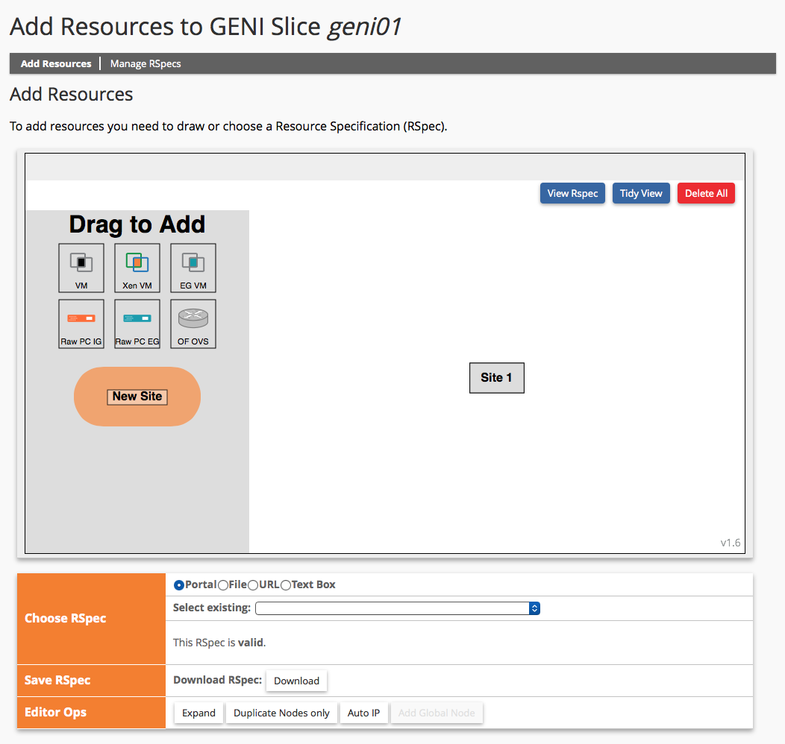
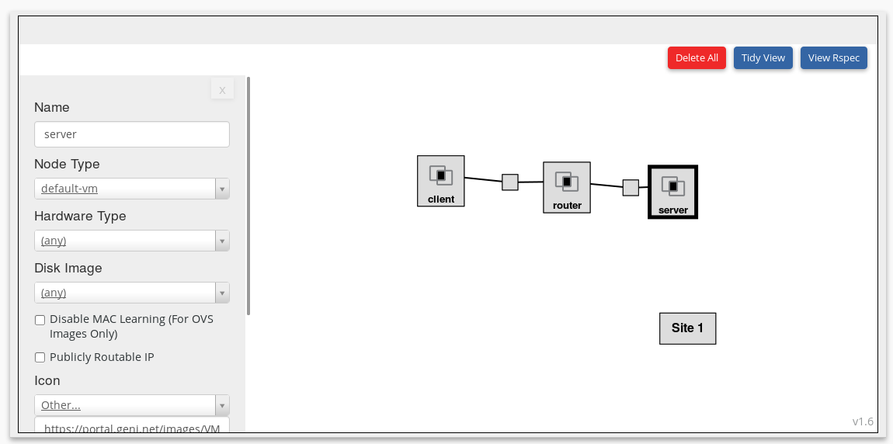
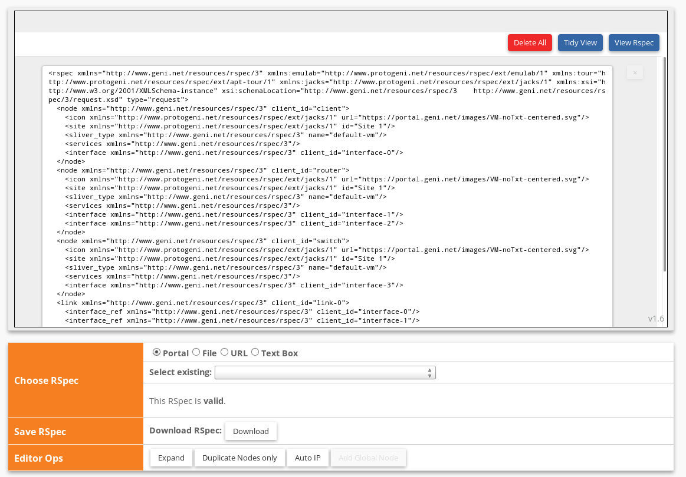
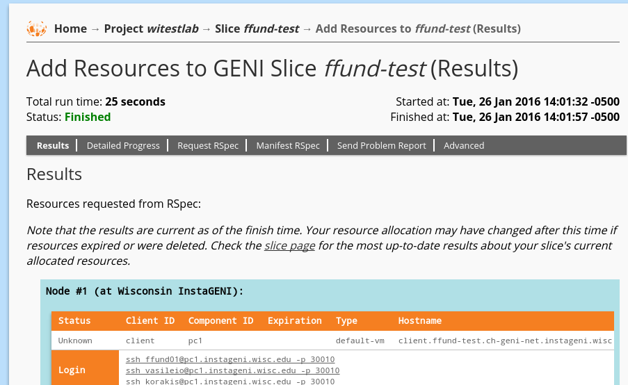
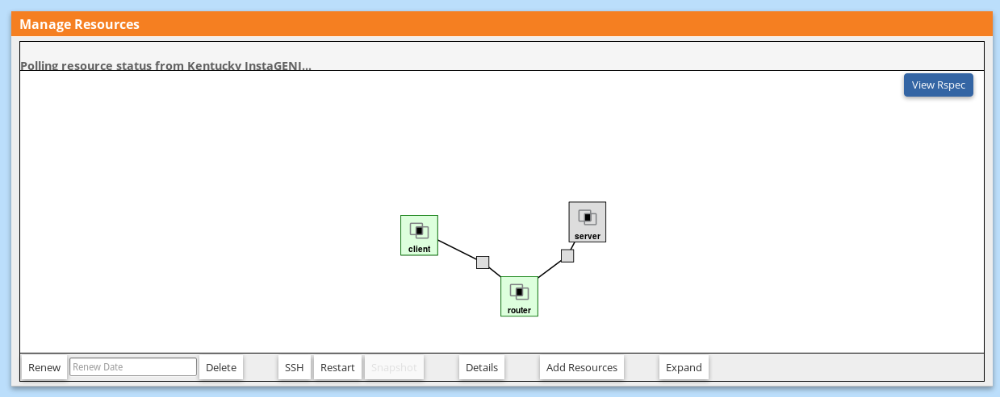

## 1.2 Reserve and log in to resources on GENI

Whenever you run an experiment on GENI, you will

1. Create a _slice_, a kind of logical "container" for your experiment.
2. Set up the particular configuration of resources (hosts and links) that you need on the GENI Portal.
3. Submit a request to reserve that configuration for use in your experiment.
4. Log in to the hosts that you have reserved to execute your experiment.

Also, when you finish an experiment and have saved all the data somewhere safe, you will _delete_ the resources in your experiment to free them for use by other experimenters.

### Exercise 1 - Create a slice

To do anything on GENI, you need to create a *slice*. A slice is a "container" for the resources that will be used in an experiment (read more [here](http://groups.geni.net/geni/wiki/GENIConcepts#Slice)).

Slices have _members_; anyone who has is a member of a slice will have their keys installed on all resources that have been reserved since they were added as a member. As project lead, your instrutor has access to all resources on all slices in the project. When you create a slice, you will have access to the resources in your slice, as long as you don't lose your key!

Create a slice by clicking [New Slice](https://portal.geni.net/secure/createslice.php) in the portal: then enter a slice name and click "Create Slice". All slices in a project must have a unique name. To make your slices easy to distinguish from your classmates', please include your username in your slice name. For example, for this assignment, I might call my slice "lab1-ff524."

**Slices expire**. That's OK - they are supposed to expire if you're finished with an experiment. But pay special attention to your slice expiration date! When your slice expires, you will lose access to all of the resources in your slice. Individual resources have their own expiration date, which may be different than, but not later than, the slice expiration date. You must make sure to retrieve any data saved on your resources before they expire.

### Exercise 2 - Set up resources

Once you have created your slice, you will be presented with a blank canvas that allows you to manage resources in your slice. You can click on "Add resources" to add resources (hosts and links) in your desired configuration to your slice. This will open a web-based tool called Jacks. Jacks is a graphical tool for creating a Resource Specification document (RSpec) and submitting a request for the resources described in the RSpec.

After you click on "Add Resources" inside your slice page, Jacks will be open in Edit mode, which looks something like this:

There are two ways to set up the hosts and links you want for an experiment:

* By drawing the configuration on the canvas yourself. Jacks will automatically create the RSpec based on your drawing.
* By loading an already-prepared RSpec.

In this exercise you will practice both ways.

First, draw the configuration on your canvas.  Click on the black "VM" icon and drag it onto the white canvas. This icon represents a generic default virtual machine, suitable for general-purpose tasks. Repeat the above step two more times. You should now see three VM boxes on the canvas.

To edit the hostname of the VM, click the VM box. In the "Name" field at the top, replace "node-0" with "client" (use all lowercase for hostnames, by convention.) Name the other nodes "router" and "server".

Now click near the "client" VM box on the canvas, then click and drag towards the "router" VM. Release when you reach the "router" VM. You should now see a line and a box representing a link connecting the two VMs. Repeat this step to connect the "router" to the "server". Your canvas should now look like this:

You can customize the details of your topology further in Jacks - e.g. you can set the characteristics (capacity, for example) of each of the network links, or change the hosts' software resources (disk image, operating system), or network configuration (IP address, netmask) of the VMs. All of these customizations will also be reflected in the RSpec. For today's experiment, we won't need many customizations. We will, however, assign IP addresses and netmasks to each network interface.

To assign IP addresses and netmasks to the interfaces that connect the client and router, click on the small box on the link between these two hosts. Look for the section titled "Interface to **client**". In the IP section, fill in the address **10.0.0.2** and in the netmask section, fill in  **255.255.255.0**. Then look for the section titled "Interface to **router**" and fill in the IP address **10.0.0.1** and netmask **255.255.255.0**.

Click on the small box on the link between the router and server, and follow a similar procedure to assign IP addresses to the interfaces on _this_ link: use IP **10.0.1.2** with netmask **255.255.255.0** for the server, and IP **10.0.1.1** with netmask **255.255.255.0** for the router.

The configuration of VMs and links is typically referred to as a "topology". Behind the scenes, Jacks is creating an RSpec that completely describes the topology you have just drawn and configured. To see the RSpec that you have just generated, click on "View RSpec":

An RSpec is a very useful document, because once you have an RSpec for a particular toplogy, you can use it to reserve the same topology many times (or share a topology) without having to go through the trouble of specifying the topology and configuration details by hand in the portal. 

Try this out for yourself: use the "Download RSpec" button below the canvas to save your RSpec to a file. Once you have done that, use the "X" button in the Jacks editor to return to the canvas view. Then use the "Delete All" button in the Jacks editor to clear your canvas. 

Now that you have an empty canvas, we'll load the same configuration you created previously, from the file that you downloaded. Below the canvas, you'll see a "Choose RSpec" section with a few choices (portal, file, URL, text box) that allows you to provide an RSpec document in several ways. Choose the "file" option and choose the file that you've just saved your RSpec to. You should see your three-node topology displayed on the canvas.

### Exercise 3 - Reserve resources

At this point, your RSpec is still _unbound_. This means that it is a "generic" document that doesn't specify which GENI _aggregate_ (host site) the resources in your topology will be on. 

Before you can reserve your topology, you need to bind your RSpec to a particular aggregate. To do this, click on the "Site 1" box on the canvas and choose an aggregate from the dropdown list, according to the instructions in the box below.

> **Choosing an aggregate**: There are several things to consider when choosing an aggregate:
>
> * **Aggregate type**: GENI aggregates come in several flavors (e.g. ExoGENI, InstaGENI.) For the lab assignments in this course, we will use only InstaGENI aggregates.
> * **Current status**: Aggregates sometimes go offline or are otherwise unavailable. Check the [AM Status](https://portal.geni.net/amstatus.php) page to see the status of aggregates at any given time, and avoid those that are listed as "Down." You may also check the calendar of [scheduled maintenance events](http://tick.globalnoc.iu.edu/public_tools/cals/public/gmoc/www/month.php?cal[]=Scheduled) and [unscheduled maintenance events](http://tick.globalnoc.iu.edu/public_tools/cals/public/gmoc/www/month.php?cal[]=Unscheduled) and avoid those which are undergoing maintenance of some kind during the time that you'll need to use them.
> * **Current load**: Each aggregate has a limited number of VMs, CPU cores, memory, and network capacity, and will refuse requests that it cannot satisfy based on its current load. If the aggregate you choose is overloaded, your request will fail and you will have to try again with another aggregate.
> * **Load balancing**: To avoid overwhelming any single GENI aggregate, educators using GENI are asked to assign different students to different GENI aggregates. To facilitate this, please choose an aggregate whose name starts with a letter that is no more than 5 letters away from the first letter of your last name. (For example, my last name begins with an F, so I will choose from Case Western, CENIC, Clemson, ... , Kentucky, Kettering.)
> * **Failure**: If your resource request fails, or your VMs fail to come up, try again on a different aggregate (after deleting any remaining VMs in your slice).

Once your resource request is bound to a particular aggregate, you will be able to reserve your resources; scroll down to the bottom of the page and click on "Reserve Resources." This will submit your RSpec to the aggregate you've selected, which will attempt to satisfy your request. If the aggregate believes it is able to give you the resources you've requested, then you'll see that your reservation has finished:

If your request fails at this point, you should try again with a different aggregate. (If you continue to get failed requests with multiple different aggregates, you may have a problem with your RSpec and you should double-check your work from Exercise 2. For example, if you put an IP address in the "Capacity" field instead of the "IP Address" field, your reservation request will fail.)

### Exercise 4 - Log in to resources

Once you have successfully reserved your resources, it will still take some time before your resources are ready for you to log in. To see resource status, go to the slice page: in the menu bar at the top of the page, choose Home > Slices and then click on the name of the slice.

On your slice page, the canvas will automatically refresh to show you the status of your VMs - each VM will turn green as it becomes available for log in:

This may take some time. 

> **What if it fails?** If the aggregate is unable to bring up the VMs you requested (even if the request "finishes"), it may say "Resources at X have failed" on the slice page, and you may get an email telling you that your VMs failed to boot. If this happens, delete the resources (use the "Delete" button at the bottom of the canvas). Then, try to reserve your resources again with a different aggregate.

Once all of your resources are ready to log in, you will need to find out the details of each host (its hostname and the port number that you will use for SSH access). To get this information, click on "Details" at the bottom of the canvas. This will take you to a page that lists login details for each host in your experiment.

