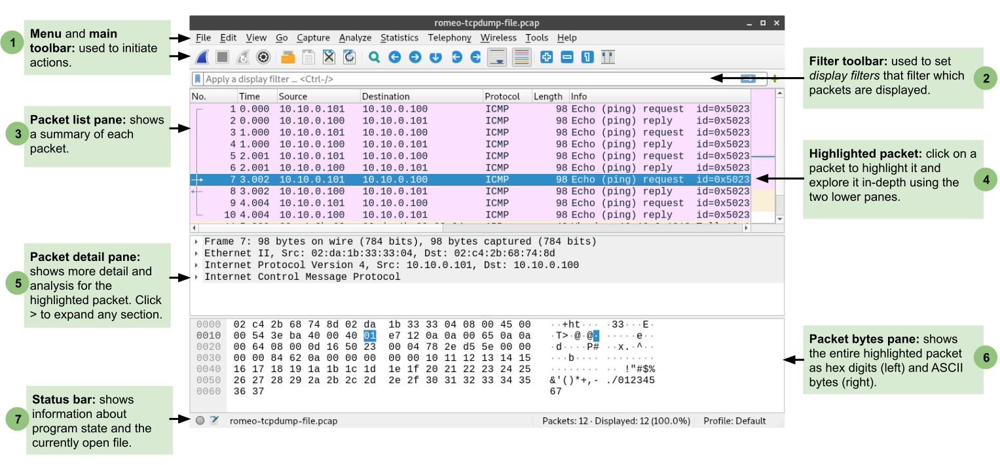

## 1.5 Using `tcpdump` and Wireshark

Finally, in this section you will practice using `tcpdump` and Wireshark, two software applications for *packet capture* and *packet analysis*. Using these applications, we can capture raw network data as it arrives at or leaves any host in our experiments, save the raw network packets in a file, and analyze the packets in this file in order to gain insight into network protocols and their behavior.

You will use these utilities in every lab exercise for the remainder of the course.

### Exercise 11 - Capture network traffic with `tcpdump`

Both Wireshark and `tcpdump` can be used to capture packets from a live network. However, `tcpdump` is a terminal-based application while Wireshark has a graphical user interface. Since we have terminal-based SSH sessions on our remote hosts, we will use `tcpdump` to capture network packets.

We will start by learning how to use `tcpdump` to capture all network packets arriving at or leaving a particular network interface. When using `tcpdump`, we will use the `-i` argument to specify the name of the interface that we want to capture traffic on. 

On the "romeo" host, run

```
tcpdump -i eth1
```

You should see an error message, similar to the following:


```
tcpdump: eth1: You don't have permission to capture on that device
(socket: Operation not permitted)
```

This is because only users with computer administrator privileges are allowed to capture raw network traffic.  On Linux, to signal to the operating system that we want to run a command with admin privileges, we preface the command with `sudo` - "superuser do". Try it now with


```
sudo tcpdump -i eth1
```

You shouldn't see any error messages this time, now that you are running `tcpdump` with the correct privileges. But you won't see any network packets, either, because there is not traffic on the network. To generate some traffic, open a second SSH session to the "juliet" host, and run

```
ping -c 5 10.10.0.100
```

while the `tcpdump` is still running on "romeo". This will generate some traffic between the "juliet" host and the "romeo" host. You'll see a summary view of each packet in the `tcpdump` output.


### Exercise 12 - Save a packet capture to a file and open them in Wireshark

For most lab exercises, we will want to use `tcpdump` to capture network packets and *save them to a file* so that we can analyze them afterwards. To save a packet capture to a file, we use the `-w` argument in `tcpdump`.

Try it now - on "romeo", run

```
sudo tcpdump -i eth1 -w romeo-tcpdump-file.pcap
```

Then, while the `tcpdump` is still running on "romeo", on "juliet" run

```
ping -c 5 10.10.0.100
```

Unlike before, you won't see a summary of each packet in the `tcpdump` window on "romeo", since the output is now being saved to a file instead of being displayed on a terminal. Wait for the `ping` to finish, then press Ctrl+C to stop the `tcpdump` on romeo. When you do, it will tell you how many packets were captured, e.g.

```
12 packets captured
12 packets received by filter
0 packets dropped by kernel
```

In a new terminal, use `scp` to transfer the `romeo-tcpdump-file.pcap` file to your laptop.

Then, open Wireshark. Use File > Open to find the file and open it for further analysis. Use the example below to find the main parts of the Wireshark window:




### Exercise 13 - Useful display options and capture options in `tcpdump`

### Exercise 14 - Useful display options in Wireshark