## Exercises with a routing table at end host

You may have assumed that a routing table is only relevant when there are routers connecting multiple networks; but routing tables are also used at end hosts to determine how to send packets, even on a single segment!

In this exercise, we will see how a host uses its routing table every time it sends an IP packet - even before ARP is used! We'll also see how the ARP table and routing table together determine what happens to that packet.

We will observe all of the outcomes described in this flow chart of ARP table/routing table interaction:




### Exercise - send via directly connected route

In this exercise, we'll explore the part of the diagram highlighted in pink:




These first three scenarios are a review of the ARP exercises you've done in a previous lab assignment. 


In a previous experiment, we saw that when a host needs to send an IP packet, it uses ARP to resolve the destination IP address to a MAC address. We observed three possible outcomes of this process:

* a host already has the destination IP address in its ARP table. In this case, it will directly send the IP packet with the destination host's MAC address (from the ARP table) in the destination address field of the Layer 2 header.
* a host does _not_ already have the destination IP address in its ARP table, it sends an ARP request to resolve the address, and it receives an ARP reply. Then, it will send the IP packet with the destination host's MAC address (from the ARP reply) in the destination address field of the Layer 2 header.
* a host does _not_ already have the destination IP address in its ARP table, and it sends an ARP request to resolve the address, but does _not_ receive an ARP reply. Then, it will send itself an ICMP Destination Unreachable: Host Unreachable message, indicating that it cannot reach the destination IP address. The IP packet is not sent.

However, these three scenarios only occur if the host _first_ checks its routing table, and determines that the route that matches this destination address is a **directly connected** route.

A **directly connected** route is one where:

* the `G` flag is _not_ set
* there is no gateway specified

When a network interface on a device is configured with an IP address and subnet mask, a directly connected route is *automatically* added to the routing table on that device. This automatic rule applies to all destination addresses in the same subnet as the network interface.

Let's try this now. To change the IP address and/or netmask of a given interface on our hosts, we will use the syntax

```
sudo ifconfig INTERFACE IP-ADDRESS netmask NETMASK
```

substituting appropriate values for `INTERFACE` name, `IP-ADDRESS`, and `NETMASK`. 


On romeo, run

```
sudo ifconfig eth1 10.10.0.100 netmask 255.255.255.0
```

to configure the `eth1` interface with the IP address 10.10.0.100 and subnet mask 255.255.255.0. Note that the _network address_, computed by applying the logical AND operation to the IP address and subnet mask, is 10.10.0.0.

Then, run

```
route -n
```

on romeo, and identify the directly connected route that applies to the destination 10.10.0.0 with netmask 255.255.255.0. This rule matches the address range 10.10.0.0-10.10.0.255. Note that this rule has no `G` flag set and no gateway, i.e. `0.0.0.0` in the gateway field.

Save this output for your lab report.

#### Scenario 1


For this exercise, you will need two terminal sessions on the romeo host.

On romeo, run

```
arp -i eth1 -n
```

to see the ARP table for the `eth1` interface. *If* the juliet host (10.10.0.101) is already listed in the ARP table, delete it with

```
sudo arp -d 10.10.0.101
```

and then run


```
arp -i eth1 -n
```

again. When the ARP table is empty, save this output for your lab report.

Then, on romeo, run

```
sudo tcpdump -i eth1 -w $(hostname -s)-direct-resolve-arp.pcap
```

in one terminal, and leave this running. In a second terminal on romeo, run


```
ping -c 1 10.10.0.101
```

to send an ICMP echo request to juliet.

After the reponse is returned, stop the `tcpdump` and play it back with 

```
tcpdump -enX -r $(hostname -s)-direct-resolve-arp.pcap
```

#### Scenario 2

For this exercise, you will need two terminal sessions on the romeo host.

On romeo, run 


```
arp -i eth1 -n
```

again, and verify that juliet's address is still in the ARP table. Save this output for your lab report.


Then, on romeo, run

```
sudo tcpdump -i eth1 -w $(hostname -s)-direct-table-arp.pcap
```

in one terminal, and leave this running. In a second terminal on romeo, run


```
ping -c 1 10.10.0.101
```

to send an ICMP echo request to juliet.

After the reponse is returned, stop the `tcpdump` and play it back with 

```
tcpdump -enX -r $(hostname -s)-direct-table-arp.pcap
```

#### Scenario 3

For this experiment, you will need *three* terminal sessions on the romeo host.

On the romeo host, run

```
sudo tcpdump -i eth1 -w $(hostname -s)-direct-nonexistent.pcap
```

In a second terminal window on romeo, run

```
sudo tcpdump -i lo -w $(hostname -s)-direct-lo-nonexistent.pcap icmp
```

to capture ICMP traffic on the loopback interface (i.e. ICMP messages sent from romeo to itself).

Then, in a third terminal window on romeo, run

```
ping -c 1 10.10.0.200
```

Note that there is no host with this IP address in your network configuration.

Wait for it to finish. Terminate both `tcpdump` processes with Ctrl+C. 

"Play back" a summary of the packet captures using

```
tcpdump -enX -r $(hostname -s)-direct-nonexistent.pcap
```

and 

```
tcpdump -enX -r $(hostname -s)-direct-lo-nonexistent.pcap icmp
```

### Exercise - no matching route

In this exercise, we'll explore the part of the diagram highlighted in pink:



The aim of the next exercise is to learn what happens when you try to send IP packets to a network that your host doesn't know how to reach. We are going to trigger a "network is unreachable" error message. This message occurs when there is no route in the host's routing table that describes how to reach a particular destination. 

Currently, however, there is a "default gateway" rule in the routing table that describes how to route *all* traffic whose destination address is not specifically given by any other rule. 

Run 

```
route -n
```

on romeo, and identify this rule. This rule has a destination address of 0.0.0.0 and netmask of 0.0.0.0.

When there is a "default gateway" rule, we will never observe a "network is unreachable" message, since this rule matches _every_ destination address.  Therefore, to see what happens when there is no matching rule for a destination address, we will need to remove this default gateway rule.

However, if we just remove the default gateway rule, we'll lose access to the remote host over SSH, since the SSH connection between your device and the remote host is routed using that default gateway rule. To make this exercise work without losing our SSH connection, we need to replace the default rule with one specific to the IP address we are using to connect. Then we'll be able to observe the "destination unreachable" message AND maintain our SSH connection.

#### Scenario 4

### Exercise - route via gateway


### Exercise - asymmetric subnet masks

For this exercise, we will configure addresses and subnet masks on four hosts, as follows:

| Host          | IP address    | Subnet mask     |
| ------------- | ------------- |-----------------|
| romeo         | 10.10.0.100   | 255.255.255.240 |
| juliet        | 10.10.0.101   | 255.255.255.0   |
| hamlet        | 10.10.0.102   | 255.255.255.0   |
| ophelia       | 10.10.0.120   | 255.255.255.240 |


To change the IP address and/or netmask of a given interface on our hosts, use the syntax

```
sudo ifconfig INTERFACE IP-ADDRESS netmask NETMASK
```

substituting appropriate values for `INTERFACE` name, `IP-ADDRESS`, and `NETMASK`. 


Run 


```
route -n
```

on each host, and observe the directly connected route. Save the routing tables for your lab report. 
