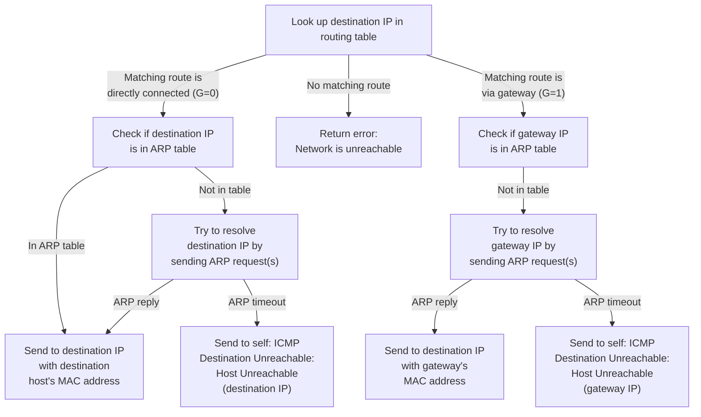

```mermaid
graph TD
    A["Look up destination IP in routing table"] 
    A -->|"Matching route is<br/>directly connected (G=0)"| B["Check if destination IP<br/> is in ARP table"]
    A -->|"No matching route"| D["Return error:<br/> Network is unreachable"]
    A -->|"Matching route is<br/>via gateway (G=1)"| C["Check if gateway IP<br/> is in ARP table"]
    B -->|"In ARP table"| F["Send to destination IP<br/> with destination <br/>host's MAC address"]
    B -->|"Not in table"| E["Try to resolve<br/> destination IP by<br/> sending ARP request(s)"]
    E -->|"ARP reply"|F
    E -->|"ARP timeout"|I["Send to self: ICMP <br/>Destination Unreachable:<br/> Host Unreachable<br/> (destination IP)"]
    C -->|"Not in table"| G["Try to resolve<br/> gateway IP by<br/> sending ARP request(s)"]
    G -->|"ARP reply"|H["Send to destination IP<br/> with gateway's<br/> MAC address"]
    G -->|"ARP timeout"|J["Send to self: ICMP <br/>Destination Unreachable:<br/> Host Unreachable<br/> (gateway IP)"]
```