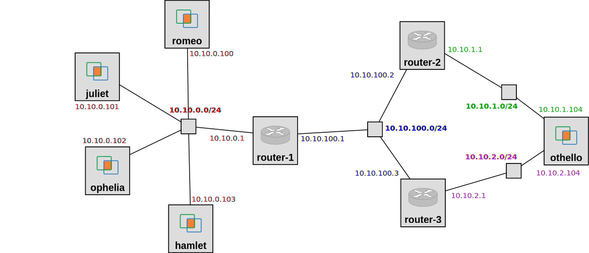

## Reserve resources

For this experiment, we will use a topology with five hosts, three routers, and four network segments, with addresses on each network interface configured as follows:

each with a netmask of 255.255.255.0.

To set up this topology in the GENI Portal, create a slice, click on "Add Resources", and load the RSpec from the following URL: [https://raw.githubusercontent.com/ffund/tcp-ip-essentials/gh-pages/lab3/3-static-routing](https://raw.githubusercontent.com/ffund/tcp-ip-essentials/gh-pages/lab3/3-static-routing)

Refer to the [monitor website](https://fedmon.fed4fire.eu/overview/instageni) to identify an InstaGENI site that has many "free VMs" available. Then bind to an InstaGENI site and reserve your resources. Wait for them to become available for login ("turn green" on your canvas) and then SSH into each, using the details given in the GENI Portal.

Use `ifconfig -a` to view the network interface configuration on each host, and save the output for your own reference.

