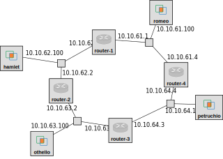

## 4.6 RIP exercises

In this section, we will examine the operation of RIP.

For this experiment, we will use a topology with four routers in a ring, and a host connected to each LAN.

To set up this topology in the GENI Portal, create a slice, click on "Add Resources", and load the RSpec from the following URL: https://raw.githubusercontent.com/ffund/tcp-ip-essentials/master/lab4/lab4-dynamic-routing.xml

The topology for this experiment, with the IP address of each interface, is illustrated in the following diagram:




The topology has four LANs:

* 10.10.61.0/24 (LAN 61)
* 10.10.62.0/24 (LAN 62)
* 10.10.63.0/24 (LAN 63)
* 10.10.64.0/24 (LAN 64)

For convenience, the last octet of each IP address is the router index (for routers) or 100 (for workstations), so that it is easy to identify

Once you have loaded the topology in the GENI Portal, bind to an InstaGENI site and reserve your resources. Wait for them to become available for login ("turn green" on your canvas). 

This RSpec also defines a configuration script that runs when each host boots, so after the resources "turn green", wait a few more minutes beyond that for the configuration script to finish running. Then SSH into each, using the details given in the GENI Portal.

Before you start, use `ifconfig -a` to capture the network interface configuration of each host and router in this topology. Save this for your lab report.

On boot, each workstation and router will only have routing rules for subnets that it directly connects to (and for the control interface). It will not have routing rules for other subnets in the experiment topology. Confirm this with

```
route -n
```

### Exercise 2

The virtual routers in our experiment are running `quagga`, a software router that includes a shell interface similar to the Cisco IOS interface. Open the shell interface on each router with:

```
export VTYSH_PAGER=more
sudo vtysh
```

(If you get an error message `sudo: vtysh: command not found` or `Exiting: failed to connect to any daemons` at this point, the configuration script hasn't finished running! Wait a few minutes for it to finish.)

In the `quagga` shell, run

```
show ip route
```

to see what routes are currently configured on each router. Save this output.

Using this shell interface, we can configure the routers to use the RIP protocol.

First, enter Global Configuration mode in each router:


```
configure terminal
```

The prompt should change (to include a `(config)` at the end), indicating that you are now in configuration mode.

Then, type

```
router rip
```

to enable RIP. Finally, you need to associate one or more networks to the RIP routing process. Run

```
network 10.10.0.0/16
```

so that all addresses from 10.10.0.0-10.10.255.255 will be enabled for RIP. (Note: this syntax is slightly different in `quagga` then in Cisco IOS.) Then run `exit` twice, until you are back in the regular `quagga` shell (not in config mode).

RIPv2 multicasts its routing table every 30 seconds to the multicast IP address 224.0.0.9. On the workstations in each network segment (romeo, hamlet, othello, petruchio), run

```
sudo tcpdump -en -i eth1 -w $(hostname -s)-rip.pcap
```

for about a minute or two, to capture these messages.

Then, run

```
show ip route
```

in the `quagga` shell on each router, to see the new routes, and save the output. 


Also see RIP-specific information in the `quagga` shell on each router with 

```
show ip rip
```

Note that the "Metric" column here shows the hop count to each destination network. Save all outputs.

After a few minutes, you can stop the `tcpdump` processes on the workstations with Ctrl+C. Transfer these to your laptop with `scp`, or play them back with `tcpdump` using:

```
sudo tcpdump -r $(hostname -s)-rip.pcap -env
```

**Lab report**: Show the RIP messages received by router 4. Using these RIP messages, draw the distance table and the routing table at router 4, assuming that number of hops is used as the metric. Compare to the output of `show ip rip` and `show ip route` at router 4.

### Exercise 3

In this exercise, we will examine how RIP reponds to link failures. We will bring down the interface on router 1 that connects to the LAN with router 2 and hamlet, and we will observe how the routing tables adapt to the change in the topology. Then, we will bring this interface back up, and observe the changes again.

First, on any router, run

```
show ip rip status
```

in the `quagga` shell, and save the output. Make a note of two important timer values: how often each router sends updates, and after how long without an update a route is removed from the routing table (the *timeout* value).

Start `tcpdump` on each of the four workstations (romeo, hamlet, othello, petruchio) with

```
sudo tcpdump -i eth1 -w $(hostname -s)-rip-failure.pcap
```

Let these run during this exercise.


On each of the routers, in the `quagga` shell, run

```
show ip rip
```

to see the current RIP database. Save the output.

On router 1, idenfity the name of the interface that has the address 10.10.62.1 (e.g. `eth1` or `eth2`). (You can refer to your previous `ifconfig` output, or you can use the `show ip route` output in the `quagga` shell, and look for the name of the interface that is directly connected to the 10.10.62.0/24 subnet.) This is the interface that connects Router 1 to the network segment that Router 2 is on. You will use this interface name in the following commands. 

Then, on Router 1, use the `quagga` shell to bring down this interface. Run

```
configure terminal
interface eth1
shutdown
```

(or substitute `eth2` if that is the name of the interface with address 10.10.62.1). Then, run `exit` twice to return to the regular `quagga` shell.

Run

```
show ip rip
```

again in the `quagga` shell on each router. You may see some transient routing rules with a metric of 16; in RIPv2, the maximum hop count is 15, and 16 is considered an "infinite" hop count, i.e. an unreachable network.


Keep running


```
show ip rip
```

on each router. For any routers that still have a route via 10.10.62.1, note the "Time" column in the output. You should see the timer slowly running out, until eventually the route is removed.

Once there are no more routes via 10.10.62.1 on any of the routers, get the final routing tables on all four routers with 

```
show ip rip
```

and save the output. Then, in the `quagga` shell on Router 1, run

```
configure terminal
interface eth1
no shutdown
```

(or substitute `eth2` if that is the name of the interface with address 10.10.62.1) to bring back up the disabled interface. Also, run `exit` twice until you return to the regular `quagga` shell.

Again, run


```
show ip rip
```

on all four routers. Keep checking until the original routes have been restored, and then save the final


```
show ip rip
```

output.

Wait at least one more minute. Then, use Ctrl+C to stop the `tcpdump` processes, and retrieve them from the workstations with `scp`. You can also play back these packet captures with


```
tcpdump -r $(hostname -s)-rip-failure.pcap -env
```


**Lab report**: From the output of `show ip rip status`, how often do the routers send updates? After how long without updates will a route be removed from the routing table (the timeout value)? 

**Lab report**: Show the RIP tables and RIP messages you captured at each stage of this exercise. Explain how the routing tables changed when the most direct path between Router 1 and Router 2 was disabled, and then changed again when the direct path was re-established.


Once you are done with this part of the lab , proceed to the [next part](el5373-lab4-47.md).
