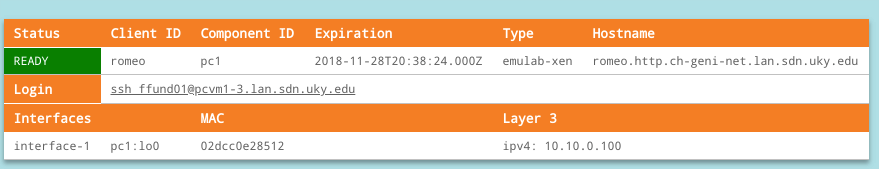

## 8.7 HTTP exercises

For this experiment, we will use a topology with two workstations (named "romeo" and "juliet"), with IP addresses configured as follows:

* romeo: 10.10.0.100
* juliet: 10.10.0.101

each with a netmask of 255.255.255.0. 

The "romeo" host will also be configured so that services running on this host will be accessible from the Internet.

To set up this topology in the GENI Portal, create a slice, click on "Add Resources", and load the RSpec from the following URL: [https://raw.githubusercontent.com/ffund/tcp-ip-essentials/master/lab8/lab8-http-rspec.xml](https://raw.githubusercontent.com/ffund/tcp-ip-essentials/master/lab8/lab8-http-rspec.xml)

Then bind to an InstaGENI site and reserve your resources. Wait for them to become available for login ("turn green" on your canvas) and then SSH into each, using the details given in the GENI Portal.

In this exercise, we will examine the operation of the Apache web server. This application is not installed by default, so we will install it on the "romeo" node. Run

```
sudo apt-get update  
sudo apt-get install apache2
```

(choose "Y" and hit Enter if prompted.) 

Once this is finished, to verify the Apache installation, review the slice details in the GENI Portal and find the hostname assigned to the "romeo" host. For example, in the following screenshot, the hostname is `romeo.http.ch-geni-net.lan.sdn.uky.edu`:



Put the hostname from _your_ slice in the address bar of a browser on your own laptop, and verify that the "Apache2 Ubuntu Default Page" loads:


This indicates that the Apache web server is running on the "romeo" host. (If you aren't able to load the default web page in a browser, you may consider trying again with resources on a different InstaGENI site.)

Before you start the exercise, use `ifconfig -a` to capture the network interface configuration of each host in this topology. Draw a diagram of the topology, and label each network interface with its name, IP address, and MAC address.

### Exercise 2

In this exercise, we will use `telnet` to manually write and send an HTTP request, and observe the response from the HTTP server.

While

```
sudo tcpdump -i eth1 -w http-$(hostname -s).pcap
```

is running on "romeo", run

```
telnet romeo 80
```

on "juliet". You should see the following indication of a successful connection:

```
Trying 10.10.0.100...
Connected to romeo-link-0.
Escape character is '^]'.
```

At the console, type the following HTTP request line by line:

```
GET /index.html HTTP/1.0
From: guest@juliet
User-Agent: HTTPTool/1.0

```

Note that you need to type "Enter" to input the last line, which is blank, and then "Enter" again to send it.

When the `telnet` process is terminated, save the output for your lab report. Identify the HTTP response header, and the HTML file sent from the HTTP server.

Terminate `tcpdump` and transfer the packet capture to your laptop with `scp`. Analyze the captured HTTP packets. 

**Lab report**: Show the HTTP request and response headers.

### Exercise 3

With HTTP 1.0, connections are not considered persistent unless a keepalive header is included. If a client supports keepalive, it includes the following in its request header:

```
Connection: Keep-Alive
```

When the server receives this request, if it supports keepalive it will include a similar line in the response header.

Then, if the client sends another request - for example, for resources linked from the initial page it requests - it will reuse the same TCP connection.

The "Apache2 Ubuntu Default Page" includes a linked image, and when we request this page using a conventional web browser (e.g. Firefox, Chrome), it will send two HTTP requests: one for the HTML page, and then another one for the linked image. In this exercise, we will observe the behavior with and without the KeepAlive directive.

By default, the KeepAlive directive is enabled on the Apache web server, so our first experiment will involve observing the behavior with KeepAlive on. On "romeo", run

```
sudo tcpdump -en -i eth0 -w http-keepalive-on-$(hostname -s).pcap "tcp port 80"
```

Note that

* We are monitoring on the "control" interface (`eth0`), not the "experiment" interface where we usually observe traffic. In this instance, we will generate traffic over the "control" interface by loading the web page from a browser on our laptop.
* We are filtering the `tcpdump` to only capture traffic on TCP port 80 (the HTTP port), otherwise the packet capture would be full of our SSH traffic, which is also carried through the "control" interface.

While `tcpdump` is running, review the slice details in the GENI Portal and find the hostname assigned to "romeo". For example, in the following screenshot, the hostname is `romeo.http.ch-geni-net.lan.sdn.uky.edu`:


On your laptop, open a browser in "private" or "incognito" mode. (This is necessary so that the browser will load the page from the server, rather than using a cached version from a previous visit.)

Put the hostname from _your_ slice in the address bar of a browser on your own laptop, and verify that the "Apache2 Ubuntu Default Page" loads:


Close your private/incognito browser window. Terminate `tcpdump` and transfer the packet capture to your laptop with `scp`.

Next, we will turn off KeepAlive support on the web server and repeat the experiment. On "romeo", run

```
sudo nano /etc/apache2/apache2.conf
```

to open the Apache configuration file. Find the line that says

```
KeepAlive On
```

and change it to

```
KeepAlive Off
```

Then, use Ctrl+O to save the file - you will see a prompt to accept the file name, hit Enter to confirm - and then Ctrl+X to exit `nano`. Restart Apache with the new configuration:

```
sudo service apache2 restart
```

Now, on "romeo", run

```
sudo tcpdump -en -i eth0 -w http-keepalive-off-$(hostname -s).pcap "tcp port 80"
```

Open a _new_ private/incognito browser window. Put the hostname from _your_ slice in the address bar of a browser on your own laptop, and verify that the "Apache2 Ubuntu Default Page" loads:


Close your private/incognito browser window. Terminate `tcpdump` and transfer the packet capture to your laptop with `scp`.


**Lab report**: With the KeepAlive directive enabled (default case), how many HTTP GET requests were sent? Which files were requested? Show all HTTP request and response headers. 

In Wireshark, use the "Statistics > Flow Graph" display to analyze your TCP connection. (Include the flow graph in your lab report.) How many TCP connections were used to retrieve the page and linked assets? How many SYN packets did you observe? What were the TCP port numbers used for the HTTP request and response for each file?


**Lab report**: With the KeepAlive directive _disabled_, how many HTTP GET requests were sent? Which files were requested? Show all HTTP request and response headers. What is different between this HTTP response header and the previous one?

In Wireshark, use the "Statistics > Flow Graph" display to analyze your TCP connection. (Include the flow graph in your lab report.) How many TCP connections were used to retrieve the page and linked assets? How many SYN packets did you observe? What were the TCP port numbers used for the HTTP request and response for each file?

Once you are done with the HTTP exercises , proceed to the [next part](el5373-lab8-89.md) of this lab (NTP exercises)
