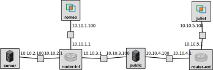

## SNMP exercises

For this experiment, we will use the topology illustrated here, with IP addresses as noted on the diagram and a subnet mask of 255.255.255.0 on each interface:




To set up this topology in the GENI Portal, create a slice, click on "Add Resources", and load the RSpec from the following URL: [https://raw.githubusercontent.com/ffund/tcp-ip-essentials/master/lab9/lab9-security-rspec.xml](https://raw.githubusercontent.com/ffund/tcp-ip-essentials/master/lab9/lab9-security-rspec.xml)

Refer to the [monitor website](https://fedmon.fed4fire.eu/overview/instageni) to identify an InstaGENI site that has many "free VMs" available.  Then bind to an InstaGENI site and reserve your resources. Wait for them to become available for login ("turn green" on your canvas) and then SSH into each, using the details given in the GENI Portal.


### SNMP setup

In this exercise, we will see how SNMP can be used to monitor networked devices.

On the "internal" router, "router-int", run

```
sudo sysctl net.ipv4.ip_forward=1
```

to make sure that packet forwarding is enabled.

Next, we will set up SNMP. 

First, download MIBs on the following nodes: "romeo", "router-int", and "server". Run

```
sudo apt-get update
sudo apt-get -y install snmp-mibs-downloader
```

Then run

```
sudo download-mibs
```

on those three nodes.

On the "router-int" node, install the SNMP daemon (server) with:

```
sudo apt-get update
sudo apt-get -y install snmpd
```

On the "romeo" and "server" nodes, install the SNMP client with:

```
sudo apt-get update
sudo apt-get -y install snmp
```


### Exercise: Configuring SNMP

On the "router" node, use

```
service snmpd status
```

to verify that the SNMP daemon is running. Try to stop it with

```
sudo service snmpd stop
```

and start it again with

```
sudo service snmpd start
```

The SNMP configuration file is located at `/etc/snmp/snmpd.conf`.  

Open the configuration file with

```
sudo nano /etc/snmp/snmpd.conf
```

Note that lines not "commented out", i.e. not preceded by a `#` character, are active.

You'll notice the following rules in the ACCESS CONTROL section of this file:

```
view   systemonly  included   .1.3.6.1.2.1.1
view   systemonly  included   .1.3.6.1.2.1.25.1
rocommunity public  default    -V systemonly
```

These rules define a "view" called `systemonly` with access to two OIDs:

* OID 1.3.6.1.2.1.1 includes objects below the **system** MIB object, which is defined within SNMPv2-MIB: `/usr/share/snmp/mibs/ietf/SNMPv2-MIB`
* OID 1.3.6.1.2.1.25.1 includes objects below the **host** MIB object, which is defined within  HOST-RESOURCES-MIB: `/usr/share/snmp/mibs/ietf/HOST-RESOURCES-MIB`

Then, this rule says that the `systemonly` view - including those two OIDs - is available on a read-only basis (`ro`) to clients using the "public" community string. 

We will make the following changes to the configuration:

1 - Listen for connections on all interfaces. Comment out the line 

```
agentAddress  udp:127.0.0.1:161
```

and un-comment the line

```
#agentAddress udp:161,udp6:[::1]:161
```

2 - Allow read-only access (not only to the two OIDs available to the "public" community - to all OIDs!) using the "secret" community string for hosts in 10.10.2.0/24. Un-comment the line

```
#rocommunity secret  10.0.0.0/16
```

and change it to read

```
rocommunity secret  10.10.2.0/24
```

Hit Ctrl+O and Enter to save the file, and Ctrl+X to exit `nano`.

Finally, restart the service with


```
sudo service snmpd restart
```

Use

```
service snmpd status
```

to verify that the SNMP daemon is running. If you made a mistake in editing the configuration file, then the service may fail at this point, so you'll need to go back and correct your mistake.

Examine the MIBs, which are located in the `/usr/share/snmp/mibs` directory and its subdirectories. In particular, study the interface MIB with

```
less /usr/share/snmp/mibs/ietf/IF-MIB
```

as well as the two MIB objects available to the "public" community: 

look for the **system** MIB object in 

```
less /usr/share/snmp/mibs/ietf/SNMPv2-MIB
```

and look for the **host** MIB object in 

```
less /usr/share/snmp/mibs/ietf/HOST-RESOURCES-MIB
```

We will refer back to these MIBs in the next exercise.

### Exercise: Retrieving SNMP data

We will use the `snmpwalk` utility to probe the SNMP daemon running on the router.

Open two SSH sessions, one on the "romeo" host and one on the "server" host. In each, run

```
sudo tcpdump -i eth1 -w snmpwalk-public-$(hostname -s).pcap
```

Leave these running.

Now, we will probe using the "public" community string.

In another terminal on the "romeo" host, run

```
snmpwalk -v 2c -c public router-int
```

and in another terminal on the "server" host, run the same command, 

```
snmpwalk -v 2c -c public router-int
```

Save the output for your lab report. Then, stop both `tcpdump` instances.

Next, we will try to probe using the "secret" community string. 

In a terminal on the "romeo" host and another terminal on the "server" host, run

```
sudo tcpdump -i eth1 -w snmpwalk-secret-$(hostname -s).pcap
```

Leave these running.

On the "romeo" host, run

```
snmpwalk -v 2c -c secret router-int
```

and on the "server" host, run the same command, 

```
snmpwalk -v 2c -c secret router-int 
```

Save the output (or at least, a subset of it) for your lab report. Then, stop both `tcpdump` instances.

Transfer the packet captures to your laptop with `scp`.

**Lab report**: What is the difference in the output when running `snmpwalk` on the "server" host with "public" as the community string, versus "secret" as the community string, and why? Show output, and explain. What is the difference in the output when running  `snmpwalk` with "secret" as the community string on the "server" host, versus with "secret" as the community string on the "romeo" host, and why? Show output, and explain. 


### Exercise: Retrieving SNMP data, continued


We can also use `snmpget` to get an individual MIB object, rather than probing a sequence of MIB objects.

On the "server", run

```
snmpget -v 2c -c secret router-int IF-MIB::ifDescr.4
snmpget -v 2c -c secret router-int IF-MIB::ifInUcastPkts.4
snmpget -v 2c -c secret router-int IF-MIB::ifPhysAddress.4
snmpget -v 2c -c secret router-int IF-MIB::ifOutUcastPkts.4
```

Save the output for your lab report.

Immediately afterwards, run

```
ifconfig
```

on the router. Save the output.

**Lab report**: Show the output of the `snmpget` commands. Explain what each of the values you retrieved using `snmpget` means. (You can quote directly from the contents of `/usr/share/snmp/mibs/ietf/IF-MIB`.) Also, show the relevant section of the `ifconfig` output on the router. Annotate your screenshot: circle the interface information you collected using SNMP.


